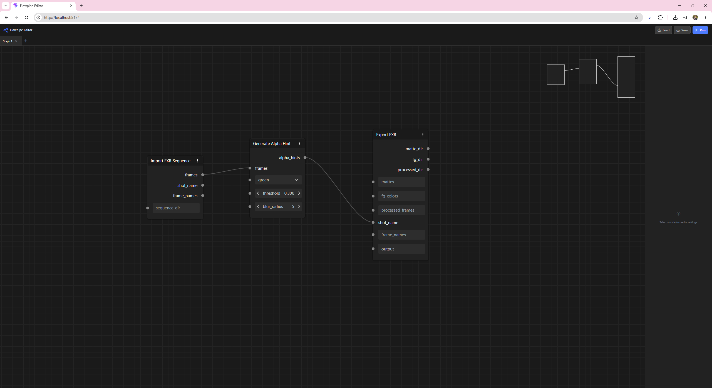

# Flowpipe Web Editor



A browser-based visual pipeline editor for [Flowpipe](https://flowpipe.io). Build, inspect, and run data pipelines by connecting nodes on a canvas — no code required. The editor communicates with a local Flowpipe backend for pipeline execution.

Built with **Vue 3**, **TypeScript**, **Baklava.js**, and **Vite**.

---

## Features

- Visual node-graph canvas for composing pipelines
- Multi-tab support — work on several graphs simultaneously
- Load and save pipelines as JSON
- Right-hand sidebar for inspecting and editing node properties
- Node search dialog (press `Tab`) to quickly insert nodes
- One-click pipeline execution via a connected backend

---

## Prerequisites

| Tool | Minimum version |
|------|----------------|
| [Node.js](https://nodejs.org) | 18 |
| npm | 9 |
| Flowpipe backend | running on `http://localhost:8000` |

The Flowpipe backend is only required for executing pipelines. The editor itself loads and runs without it.

---

## Installation

**1. Clone the repository**

```sh
git clone https://github.com/<your-username>/flowpipe-web-editor.git
cd flowpipe-web-editor
```

**2. Install dependencies**

```sh
npm install
```

**3. Start the development server**

```sh
npm run dev
```

The app is available at `http://localhost:5173`. The dev server automatically proxies `/api` requests to `http://localhost:8000`, so the Flowpipe backend just needs to be running — no extra configuration needed.

---

## Available scripts

| Script | Description |
|--------|-------------|
| `npm run dev` | Start development server with hot-module reload |
| `npm run build` | Type-check and build optimized production bundle to `dist/` |
| `npm run preview` | Preview the production build locally |

---

## Node registry

The available node types are defined in [`public/node-registry.json`](public/node-registry.json). This file is loaded at runtime and determines which nodes appear in the search dialog. Update it to reflect the steps exposed by your backend.

---

## Deployment

A GitHub Actions workflow is included that builds and deploys the editor to GitHub Pages on every push to `main`.

**Setup (one time):**

1. Push the repository to GitHub.
2. Go to **Settings → Pages** in your repository.
3. Set **Source** to **GitHub Actions**.
4. Push to `main` — the workflow runs automatically.

The site will be live at `https://<your-username>.github.io/<repo-name>/`.

For manual runs: **Actions → Deploy to GitHub Pages → Run workflow**.
