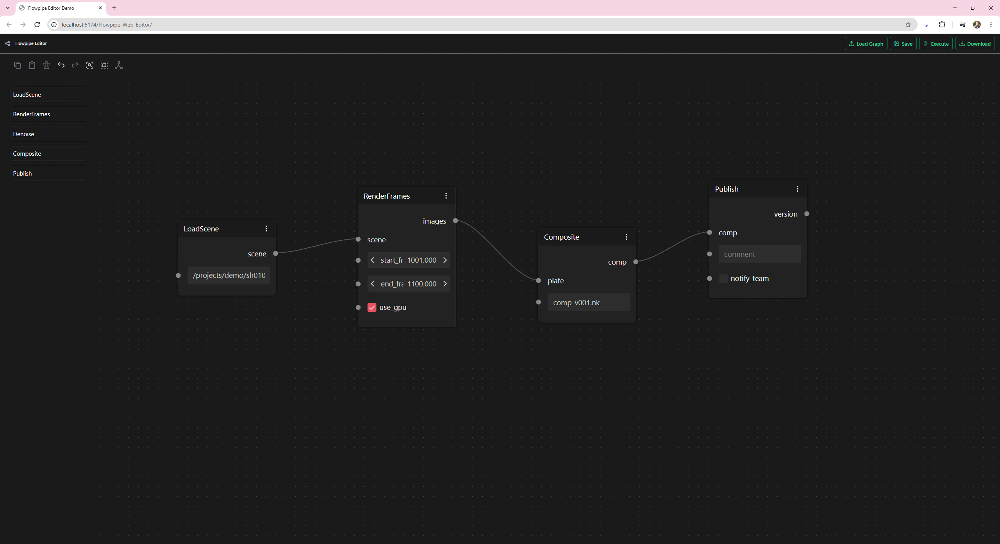

# Flowpipe Web Editor

[](https://www.npmjs.com/package/flowpipe-web-editor)
[](LICENSE)

### [Live Demo →](https://sweckeuw.github.io/Flowpipe-Web-Editor/)



A browser-based visual node editor for [Flowpipe](https://github.com/PaulSchweizer/flowpipe) graphs. Build pipelines by connecting nodes on a canvas and export them in Flowpipe's JSON format. The editor is backend-agnostic: saving and executing a graph is done by handlers your application provides.

Built with **Vue 3**, **TypeScript**, **Baklava.js**, and **Vite**. Shipped as the framework-independent custom element `<flowpipe-editor>`.

[Features](#features) · [Installation](#installation) · [Usage](#usage) · [API](#api) · [Controls](#controls) · [Known limitations](#known-limitations) · [Development](#development) · [License](#license)

---

## Features

- Visual node-graph canvas — add nodes from the node palette and connect outputs to inputs
- Toolbar with undo / redo, copy / paste, box select and zoom to fit
- Node library defined as serialized Flowpipe nodes — input widgets are derived from the default values
- Open an existing Flowpipe graph in the editor
- Graphs are exported in Flowpipe's JSON serialization format and can be loaded with `Graph.from_json()`
- **Save** and **Execute** buttons that pass the graph to your own handlers
- Download the graph as a `.json` file
- Works in any app — plain JavaScript, Vue, React or any other framework

---

## Requirements

- A current browser with Custom Elements support (Chrome, Edge, Firefox, Safari)
- For development only: Node.js `^20.19.0` or `>=22.12.0` (CI uses Node 24)

---

## Installation

```sh
npm install flowpipe-web-editor
```

The package is self-contained: Vue, Baklava.js and PrimeVue are bundled, so there are no peer dependencies to install (≈ 490 kB gzipped).

---

## Usage

### Minimal example

```ts
import { registerFlowPipeEditor } from 'flowpipe-web-editor'

// Defines the <flowpipe-editor> custom element
registerFlowPipeEditor()

const editor = document.createElement('flowpipe-editor')
editor.style.cssText = 'display: block; height: 100vh'

// Nodes the editor offers, in Flowpipe's serialization format
editor.nodeLibrary = [
  {
    module: 'flowpipe.node',
    cls: 'FunctionNode',
    file_location: null,
    name: 'Add',
    identifier: 'Add-1',
    inputs: {
      a: { name: 'a', value: 0, connections: {}, sub_plugs: {} },
      b: { name: 'b', value: 0, connections: {}, sub_plugs: {} }
    },
    outputs: {
      result: { name: 'result', value: null, connections: {}, sub_plugs: {} }
    },
    metadata: { label: 'Add' },
    func: { module: 'my_nodes', name: 'add' }
  }
]
editor.runHandler = (graph) => console.log(graph)

document.body.append(editor)
```

Arrays, objects and functions are set as properties, not as HTML attributes.

### Vue

Tell the Vue compiler that `flowpipe-editor` is a custom element and bind the props with `.prop`:

```ts
// vite.config.ts
vue({
  template: {
    compilerOptions: { isCustomElement: (tag) => tag === 'flowpipe-editor' }
  }
})
```

```vue
<script setup lang="ts">
import { registerFlowPipeEditor } from 'flowpipe-web-editor'

registerFlowPipeEditor()
</script>

<template>
  <flowpipe-editor :nodeLibrary.prop="nodeLibrary" :runHandler.prop="runGraph" style="display: block; height: 100vh" />
</template>
```

### React

React 19 passes arrays, objects and functions to custom elements as properties:

```tsx
import { registerFlowPipeEditor } from 'flowpipe-web-editor'

registerFlowPipeEditor()

export function PipelineEditor() {
  return <flowpipe-editor nodeLibrary={nodeLibrary} runHandler={runGraph} style={{ display: 'block', height: '100vh' }} />
}
```

React 18 and older pass them as attributes. There, create the element with `document.createElement` as shown in the [minimal example](#minimal-example) and append it to a container `ref`.

### Props

| Prop | Type | Default | Description |
|------|------|---------|-------------|
| `nodeLibrary` | `SerializedFlowpipeNode[]` | `[]` | Nodes the editor offers in the node sidebar, grouped by `metadata.editor.category`. The default `value` of an input decides its widget: boolean → checkbox, number → number field, string or `null` → text field. |
| `graph` | `SerializedFlowpipeGraph` | – | Flowpipe graph that is opened when the editor starts. Its `name`, `module` and `cls` are kept when the graph is exported. |
| `saveHandler` | `(graph: SerializedFlowpipeGraph) => Promise<void> \| void` | – | Called with the current graph when **Save** is clicked. The button is only shown if the handler is set. |
| `runHandler` | `(graph: SerializedFlowpipeGraph) => Promise<void> \| void` | – | Called with the current graph when **Execute** is clicked. The button is only shown if the handler is set. |
| `displayDownloadButton` | `boolean` | `false` | Shows the **Download** button, which saves the graph as `<graph name>.json`. |
| `displayLoadButton` | `boolean` | `false` | Shows the **Load Graph** button for selecting a `.json` file. *Work in progress.* |
| `disableSidebar` | `boolean` | `false` | Hides the node sidebar on the left, from which nodes are dragged onto the canvas. |
| `disableInspector` | `boolean` | `false` | Hides the inspector sidebar on the right. It shows the graph info when no node is selected, and the name, inputs and a remove button of the selected node. |

`nodeLibrary` and `graph` are only read when the editor is initialized, so set them before the element is added to the DOM.

While a handler's promise is pending, its button shows a spinner and is disabled.

### Slots

| Slot | Default | Description |
|------|---------|-------------|
| `title` | Icon and "Flowpipe Editor" | Content on the left of the top bar. |

Pass the content as a child of the element with a `slot` attribute:

```html
<flowpipe-editor>
  <span slot="title">My Project</span>
</flowpipe-editor>
```

Slot content is only read when the element is added to the DOM, so append the children before that.

---

## API

| Export | Kind | Description |
|--------|------|-------------|
| `registerFlowPipeEditor(tagName = 'flowpipe-editor')` | function | Defines the custom element. Calling it again with the same tag name does nothing. |
| `FlowPipeEditorElement` | class | The custom element constructor, for registering it yourself with `customElements.define()`. |
| `FlowPipeEditorHTMLElement` | type | Instance type of the element (`HTMLElement & FlowPipeEditorProps`). |
| `FlowPipeEditorProps` | type | The [props](#props) of the element. |
| `SerializedFlowpipeNode` | type | A node in Flowpipe's JSON format. |
| `SerializedFlowpipeGraph` | type | A graph in Flowpipe's JSON format. |

The package registers `flowpipe-editor` in TypeScript's `HTMLElementTagNameMap`, so `document.createElement('flowpipe-editor')` is fully typed.

---

## Controls

| Action | Input |
|--------|-------|
| Pan | Drag on empty canvas |
| Zoom | Mouse wheel, pinch on touch devices |
| Fit all nodes into view | `F` |
| Add node | Drag from the node palette onto the canvas |
| Move node | Drag the node header |
| Select / add to selection | Click / `Ctrl` or `Shift` + click |
| Box select | `B`, then drag on the canvas |
| Delete selected nodes | `Delete` |
| Rename / delete a node | Right-click the node header or click `⋮` |
| Connect | Drag from an output (right) to an input (left) |
| Remove a connection | Drag it off the input and release on empty canvas |
| Undo / Redo | `Ctrl + Z` / `Ctrl + Y` |
| Copy / Paste | `Ctrl + C` / `Ctrl + V` |

---

## Known limitations

- Flowpipe subgraphs are not supported: `subgraphs` of an opened graph are ignored, and Baklava subgraph nodes are skipped on export.
- Connection types are not validated — any output can be connected to any input.

---

## Development

**1. Clone the repository**

```sh
git clone https://github.com/SweckEUW/Flowpipe-Web-Editor.git
cd Flowpipe-Web-Editor
```

**2. Install dependencies**

```sh
npm install
```

**3. Start the development server**

```sh
npm run dev
```

This starts a local playground ([`src/main.ts`](src/main.ts)) with demo nodes and dummy save/run handlers at `http://localhost:5173`. It is not part of the published package.

### Scripts

| Script | Description |
|--------|-------------|
| `npm run dev` | Start the playground with hot-module reload |
| `npm run build` | Type-check and build the package to `dist/` |
| `npm run build:watch` | Rebuild the package on every change, e.g. to test it in another project with `npm link` |

### Project structure

```
src/
  index.ts          Package entry: custom element, registerFlowPipeEditor, exported types
  components/       FlowPipeEditor (root), TopBar, GraphCanvas
  composables/      useFlowpipeEditor – Baklava setup, node registration, export
  util/             Converters between Flowpipe JSON and Baklava's graph state
  types/            Flowpipe serialization types, editor props
  main.ts           Local playground (not published)
demo/               Demo app that uses the published npm package
.github/workflows/  publish.yml (npm release), pages.yml (demo deployment)
```

---

## Acknowledgements

- [Flowpipe](https://github.com/PaulSchweizer/flowpipe) — the Python graph framework this editor is built for
- [Baklava.js](https://github.com/newcat/baklavajs) — node editor engine and renderer
- [PrimeVue](https://primevue.org) and [Tailwind CSS](https://tailwindcss.com) — UI components and styling

---

## License

[MIT](LICENSE) © 2026 Simon Weck
