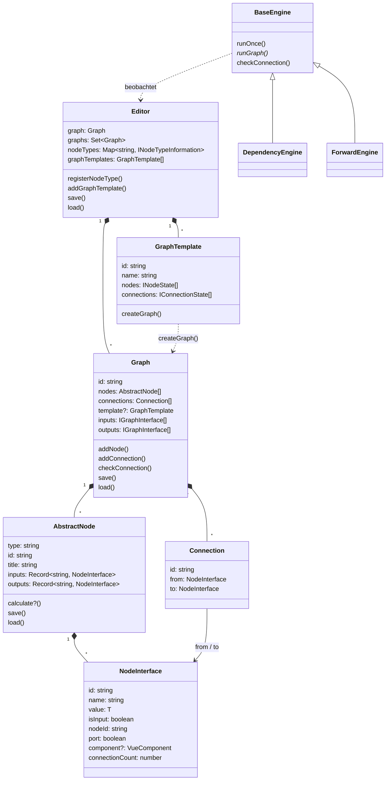

# BaklavaJS – Funktionsweise im Detail

Dieses Dokument beschreibt, wie die TypeScript-Bibliothek [BaklavaJS](https://github.com/newcat/baklavajs) intern funktioniert: Editor, Nodes, NodeInterfaces (Ports und Widgets), Connections, Graph-Auswertung durch die Engines, Subgraphs, das JSON-Format und der Vue-Renderer.

- **Grundlage:** BaklavaJS-Repository, Stand `v2.8.1-12-gb6c081a`.
- **Pfadangaben** wie `graph.ts:226` beziehen sich auf das jeweilige Package-Verzeichnis unter `packages/`, also z. B. `packages/core/src/graph.ts`.
- Alle Beispielausgaben in diesem Dokument und alle Punkte in Abschnitt 11 („Bekannte Fallstricke") wurden gegen diesen Stand ausgeführt und geprüft. Dafür wurden die Quellen der Packages `core`, `engine`, `events` und `interface-types` mit esbuild gebündelt und unter Node 22 ausgeführt.

---

## Inhalt

1. [Überblick](#1-überblick)
2. [Architektur auf einen Blick](#2-architektur-auf-einen-blick)
3. [Editor](#3-editor)
4. [Nodes](#4-nodes)
5. [NodeInterfaces und Datentypen](#5-nodeinterfaces-und-datentypen)
6. [Connections](#6-connections)
7. [Graph-Auswertung: die Engines](#7-graph-auswertung-die-engines)
8. [Subgraphs](#8-subgraphs)
9. [Serialisierung und JSON-Format](#9-serialisierung-und-json-format)
10. [Vue-Renderer](#10-vue-renderer)
11. [Bekannte Fallstricke](#11-bekannte-fallstricke)
12. [Vergleich mit Flowpipe](#12-vergleich-mit-flowpipe)
13. [Konsequenzen für den Web-Editor](#13-konsequenzen-für-den-web-editor)
14. [Dateiübersicht](#14-dateiübersicht)

---

## 1. Überblick

BaklavaJS ist ein **Graph-/Node-Editor für den Browser**, geschrieben in TypeScript. Anders als Flowpipe ist es in erster Linie eine **GUI-Bibliothek**: Der Schwerpunkt liegt auf dem Bearbeiten von Graphen, die Ausführung ist ein optionaler Zusatz.

Eigenschaften, die man kennen sollte:

- **Modularer Monorepo-Aufbau.** Man nimmt nur die Packages, die man braucht. Nur `renderer-vue` hängt von Vue 3 ab.
- **Dynamisch typisiert im Kern.** `NodeInterface<T>` ist zur Laufzeit typlos; Typprüfung gibt es nur optional über `@baklavajs/interface-types`.
- **Asynchron.** `calculate()` darf ein `Promise` zurückgeben, die Engines sind durchgehend `async`.
- **Undo/Redo, Copy/Paste, Hotkeys, Kontextmenü, Minimap** sind eingebaut (im Vue-Renderer).
- **Kein Backend.** Persistenz ist ein JSON-Objekt aus `editor.save()`; das Schreiben übernimmt der Aufrufer.

Die Packages:

| Package | Version | Inhalt |
|---|---|---|
| `@baklavajs/core` | 2.8.1 | Datenmodell: `Editor`, `Graph`, `AbstractNode`, `NodeInterface`, `Connection`, Subgraph-Infrastruktur |
| `@baklavajs/events` | 2.8.0 | Event- und Hook-System (`BaklavaEvent`, `SequentialHook`, `Subscribable`, Proxies) |
| `@baklavajs/engine` | 2.8.1 | Ausführung: `DependencyEngine`, `ForwardEngine`, topologische Sortierung |
| `@baklavajs/interface-types` | 2.8.1 | Optionale Typen für Interfaces samt Konvertierungen |
| `@baklavajs/renderer-vue` | 2.8.1 | Vue-3-Oberfläche: Editor-Komponente, Widgets, Commands, History, Clipboard |
| `@baklavajs/themes` | 2.8.1 | SCSS-Themes (`classic`, `syrup-dark`) |
| `baklavajs` | 2.8.1 | Sammelpaket, das alle obigen re-exportiert, plus Browser-Bundle |

Eine zentrale Designentscheidung unterscheidet Baklava von Flowpipe: **Connections sind echte Objekte.** Ein `Graph` führt zwei Listen – `nodes` und `connections`. Die Kanten sind nicht aus den Ports abgeleitet, sondern explizit gespeichert.

---

## 2. Architektur auf einen Blick



Der Datenfluss ist bewusst getrennt:

- Das **Modell** (`core`) kennt keine Ausführung und keine Darstellung. Es weiß nur, welche Nodes und Kanten es gibt.
- Die **Engine** (`engine`) hängt sich per Event und Hook an den Editor. Sie berechnet Werte, schreibt sie aber standardmäßig **nicht** in den Graphen zurück – dafür gibt es `applyResult()`.
- Der **Renderer** (`renderer-vue`) erweitert die Core-Klassen per TypeScript-*Module Augmentation* um Felder wie `position`, `width` oder `panning` (`overrides.ts:12-58`).

---

## 3. Editor

`Editor` (`core/src/editor.ts:27`) ist die Wurzel des Modells.

| Member | Bedeutung |
|---|---|
| `graph` | Der **Root-Graph**. Wird im Feldinitialisierer angelegt (`editor.ts:57`), existiert also immer. |
| `graphs` | `ReadonlySet<Graph>` aller Graphen, inklusive der Subgraph-Instanzen. Jeder `Graph`-Konstruktor ruft `editor.registerGraph(this)` auf. |
| `nodeTypes` | `Map<string, INodeTypeInformation>`: Typname → `{ type, category, title }`. |
| `graphTemplates` | Liste der Subgraph-Vorlagen. |
| `events` / `hooks` | Siehe Abschnitt 10.4. |

### 3.1 Node-Typen registrieren

```ts
editor.registerNodeType(MyNode, { category: "Math", title: "Addition" });
```

`registerNodeType` (`editor.ts:96`) **instanziiert die Node einmal**, nur um `type` und `title` auszulesen. Der Konstruktor einer Node muss also ohne Argumente und ohne Graph-Kontext lauffähig sein.

Der Editor registriert im eigenen Konstruktor bereits `GraphInputNode` und `GraphOutputNode` (`editor.ts:86-89`). Der Vue-Renderer registriert zusätzlich deren Unterklassen `SubgraphInputNode` und `SubgraphOutputNode` (`viewModel.ts:112-113`).

Wird ein Typ nicht registriert, scheitert das Laden dieser Nodes – aber nur mit einer Warnung, nicht mit einer Exception:

```
Graph.load() auf einem Editor ohne registrierten Typ "Add":
warnings = [
  "Node type Add is not registered",
  "Node type Add is not registered",
  "Could not find interface with id ccdfe4d7-…"
]
nodes geladen: 0
```

`editor.load()` gibt diese Warnungen zurück **und** schreibt sie zusätzlich per `console.warn` (`editor.ts:207`).

### 3.2 Speichern und Laden

```ts
const state = editor.save();          // { graph, graphTemplates }
const warnings = editor.load(state);  // string[] – leer heißt: alles geladen
```

`load` entfernt zuerst alle Graph-Templates, legt sie aus dem State neu an und ruft dann `graph.load(state.graph)` für den Root-Graphen.

---

## 4. Nodes

### 4.1 Aufbau von `AbstractNode`

`AbstractNode` (`core/src/node.ts:35`) ist die Basisklasse aller Nodes.

| Attribut | Bedeutung |
|---|---|
| `type` | Typname, abstrakt. Muss als String im `Editor` registriert sein, sonst lässt sich die Node nicht laden. |
| `id` | `uuidv4()`, global eindeutig. Wird beim Laden aus dem State übernommen. |
| `title` | Anzeigename. Setter feuert `beforeTitleChanged` (preventable) und `titleChanged`. |
| `inputs` / `outputs` | `Record<string, NodeInterface>`. Der **Key** ist der Programmier-Name, `intf.name` der Anzeigename – das sind zwei verschiedene Dinge. |
| `calculate?` | Optionale Rechenfunktion. Fehlt sie, verhält sich die Node als Passthrough (siehe 7.3). |
| `graph` | Der Graph, in dem die Node liegt; `undefined`, solange sie nirgends hinzugefügt wurde. |
| `events` / `hooks` | 12 Events und 2 Hooks (`beforeLoad`, `afterSave`). |

Es gibt **keine Eindeutigkeitsprüfung für `title`**. Anders als bei Flowpipe ist der Anzeigename rein kosmetisch; identifiziert wird ausschließlich über `id`.

### 4.2 Zwei Arten, Nodes zu definieren

**a) Deklarativ mit `defineNode` (üblich):**

```ts
const Add = defineNode({
    type: "Add",
    inputs: {
        a: () => new NumberInterface("A", 1),
        b: () => new NumberInterface("B", 1),
    },
    outputs: {
        result: () => new NodeInterface("Result", 0),
    },
    calculate({ a, b }) {
        return { result: a + b };
    },
});

editor.registerNodeType(Add);
editor.graph.addNode(new Add());
```

`defineNode` (`core/src/defineNode.ts:32`) gibt eine **Klasse** zurück, keine Instanz. Wichtig ist, dass `inputs`/`outputs` **Factory-Funktionen** sind: Jede Instanz bekommt eigene Interface-Objekte. Schriebe man `a: new NumberInterface(...)`, teilten sich alle Instanzen ein Interface.

**b) Klassenbasiert:**

```ts
class Add extends Node<{ a: number; b: number }, { result: number }> {
    public readonly type = "Add";
    public inputs = {
        a: new NumberInterface("A", 1),
        b: new NumberInterface("B", 1),
    };
    public outputs = {
        result: new NodeInterface("Result", 0),
    };
    public calculate({ a, b }) {
        return { result: a + b };
    }
}
```

Beim klassenbasierten Ansatz muss man `initializeIo()` selbst aufrufen (üblicherweise im Konstruktor oder in `onPlaced`), damit `isInput` und `nodeId` an den Interfaces gesetzt werden. `defineNode` erledigt das über `addInput`/`addOutput` automatisch.

### 4.3 Lebenszyklus

```
new MyNode()
 ├─ Konstruktor: Interfaces anlegen
 └─ onCreate()                       (nur bei defineNode)

graph.addNode(node)
 ├─ Event "beforeAddNode"  → prevent() möglich, dann kommt undefined zurück
 ├─ node.registerGraph(graph)
 ├─ _nodes.push(node)
 ├─ node = reaktive Fassung aus dem Array holen      ← wichtig für Vue
 ├─ node.onPlaced()
 └─ Event "addNode"

graph.removeNode(node)
 ├─ Event "beforeRemoveNode"  → prevent() möglich
 ├─ alle Connections zu/von den Interfaces entfernen
 ├─ aus _nodes entfernen
 ├─ Event "removeNode"
 └─ node.onDestroy()
```

Der Schritt „reaktive Fassung aus dem Array holen" (`graph.ts:148`) ist eine Vue-Besonderheit: Vue macht das Objekt beim `push` in ein reaktives Array zu einem Proxy. `addNode` gibt deshalb den Proxy zurück, nicht das ursprüngliche Objekt. **Mit dem Rückgabewert weiterarbeiten, nicht mit der Variablen, die man hineingegeben hat.**

Verifikation der Prevention:

```
graph.events.beforeAddNode.subscribe(tok, (node, prevent) => prevent());
graph.addNode(new Add())  →  undefined
graph.nodes.length        →  0
```

### 4.4 Dynamische Nodes

`defineDynamicNode` (`core/src/dynamicNode.ts:58`) erzeugt Nodes, deren Interfaces sich zur Laufzeit ändern. Die `onUpdate`-Funktion bekommt die Werte der **statischen** Interfaces und gibt zurück, welche dynamischen es geben soll:

```ts
const Dyn = defineDynamicNode({
    type: "Dyn",
    inputs: { count: () => new IntegerInterface("Count", 2) },
    outputs: { out: () => new NodeInterface("Out", 0) },
    onUpdate({ count }) {
        const ins = {};
        for (let i = 0; i < count; i++) ins["i" + i] = () => new NodeInterface("I" + i, i);
        return { inputs: ins };
    },
    calculate(inputs) { /* … */ },
});
```

Verifiziertes Verhalten:

```
inputs @count=2: ["count","i0","i1"]
inputs @count=4: ["count","i0","i1","i2","i3"]
inputs @count=1: ["count","i0"]
```

Zu beachten:

- `onUpdate` feuert nur bei Änderungen an **statischen** Interfaces (`dynamicNode.ts:89-92`).
- Während `onUpdate` läuft, wird `graph.activeTransactions` hochgezählt. Die Engine ignoriert Änderungen, solange dieser Zähler > 0 ist (`baseEngine.ts:106`) – sonst würde jede einzelne Interface-Änderung eine Neuberechnung auslösen.
- `load()` ist überschrieben und läuft in drei Phasen: statische Interfaces laden → `onUpdate()` → dynamische Interfaces laden.
- Verschwindet ein dynamisches Interface, entfernt `removeInterface` auch dessen Connections (`node.ts:210-221`). Diese Connections sind danach weg und kommen bei einer späteren Rückkehr zur alten Interface-Menge **nicht** zurück.

---

## 5. NodeInterfaces und Datentypen

### 5.1 Ein Objekt für zwei Rollen

`NodeInterface` (`core/src/nodeInterface.ts:18`) ist gleichzeitig **Port** (der Anschlusspunkt für Kanten) und **Widget** (das Eingabefeld im Node-Body). Welche Rolle sichtbar ist, steuern drei Felder:

| Feld | Wirkung |
|---|---|
| `port` (Standard `true`) | Ob der Anschlusspunkt gezeichnet wird. `setPort(false)` macht daraus ein reines Widget. |
| `component` | Vue-Komponente für das Widget. Ohne sie wird nur `intf.name` als Text angezeigt. |
| `hidden` | Blendet das Interface komplett aus. |

Die Anzeigelogik steht in `NodeInterface.vue:64-66`:

```ts
showComponent = intf.component && (!intf.isInput || !intf.port || intf.connectionCount === 0)
```

Das heißt: **Sobald ein Input verbunden ist, verschwindet sein Widget** und der Name erscheint. Outputs zeigen ihre Komponente dagegen immer.

### 5.2 Vordefinierte Interfaces

Alle im Package `renderer-vue` unter `nodeinterfaces/`:

| Klasse | Wert-Typ | Bemerkung |
|---|---|---|
| `NodeInterface` | beliebig | Basis, kein Widget |
| `TextInterface` | `string` | reine Anzeige, `port = false` |
| `TextInputInterface` | `string` | einzeiliges Eingabefeld |
| `TextareaInputInterface` | `string` | mehrzeilig, öffnet die Sidebar |
| `NumberInterface` | `number` | mit optionalem `min`/`max` |
| `IntegerInterface` | `number` | validiert zusätzlich `Number.isInteger` |
| `SliderInterface` | `number` | `min`/`max` sind Pflicht |
| `CheckboxInterface` | `boolean` | |
| `SelectInterface<V>` | `V` | Items als `string[]` oder `{ text, value }[]` |
| `ButtonInterface` | `undefined` | Callback statt Wert, `port = false` |

`NumberInterface`, `IntegerInterface` und `SliderInterface` erben von `BaseNumericInterface`, die `validate(v)` implementiert. Ein ungültiger Wert wird im Widget rot markiert und **nicht übernommen** (`baseNumericInterface.ts:135-139`).

### 5.3 Es gibt im Kern keine Datentypen

`NodeInterface<T>` ist nur zur **Compile-Zeit** typisiert. Zur Laufzeit prüft der Kern beim Verbinden ausschließlich die Richtung. Verifiziert:

```
Add.a = "x", Add.b = "y"   →  result = "xy"
"xy" → zweite Add mit b = 5 →  result = "xy5"
```

Kein Fehler, keine Warnung. Anders als Flowpipe fällt es hier nicht einmal zur Laufzeit auf, weil JavaScript `+` für Strings definiert.

### 5.4 Optionale Typen: `@baklavajs/interface-types`

Typen sind ein **Opt-in**:

```ts
const stringType = new NodeInterfaceType<string>("string");
const numberType = new NodeInterfaceType<number>("number");
numberType.addConversion(stringType, (v) => String(v));

const types = new BaklavaInterfaceTypes(editor, { engine, viewPlugin: viewModel });
types.addTypes(stringType, numberType);

// im Node:
outputs: { v: () => new NodeInterface("V", 7).use(setType, numberType) }
```

`BaklavaInterfaceTypes` klinkt sich an drei Stellen ein (`interface-types/src/index.ts:60-88`):

1. `editor.graphEvents.checkConnection` – verhindert unmögliche Verbindungen.
2. `engine.hooks.transferData` – **konvertiert den Wert beim Transport** über die Kante.
3. `viewModel.hooks.renderInterface` – setzt `data-interface-type` als DOM-Attribut, damit CSS die Portfarbe setzen kann.

Verifiziertes Verhalten:

```
number → string  (Konvertierung vorhanden): erlaubt,  Wert kommt als "7" an
number → boolean (keine Konvertierung)    : abgelehnt
string → string                            : erlaubt (gleicher Typ, canConvert = true)
typisiert → untypisiert                    : erlaubt
```

Der letzte Punkt ist wichtig: `canConvert` wird nur aufgerufen, wenn **beide** Seiten einen Typ haben (`index.ts:63-65`). Ein Interface ohne `type` ist ein Joker und nimmt alles an.

### 5.5 Mehrfachverbindungen

Standardmäßig darf ein Input **eine** eingehende Verbindung haben. Diese Regel ist aber **nicht im Kern implementiert**, sondern in `BaseEngine.checkConnection` (`baseEngine.ts:258`). Verifiziert:

```
Zwei Outputs auf denselben Input, OHNE Engine : 2 Verbindungen
Zwei Outputs auf denselben Input, MIT Engine  : 1 Verbindung (die alte wird ersetzt)
```

Will man mehrere Quellen erlauben, markiert man den Input:

```ts
import { allowMultipleConnections } from "@baklavajs/engine";

inputs: { xs: () => new NodeInterface("Xs", []).use(allowMultipleConnections) }
```

`calculate` bekommt dann ein **Array**. Verifiziert: zwei Quellen mit 5 und 30 → `xs = [5, 30]`, Summe 35.

---

## 6. Connections

### 6.1 Darstellung

Eine Connection ist ein **echtes Objekt** (`core/src/connection.ts:20`):

```ts
class Connection {
    id: string;            // uuidv4
    from: NodeInterface;   // muss ein Output sein
    to: NodeInterface;     // muss ein Input sein
    destructed: boolean;
}
```

Der Konstruktor erhöht `connectionCount` auf beiden Seiten, `destruct()` verringert ihn wieder. Dieser Zähler steuert die Widget-Anzeige (5.1) und die Frage, ob ein Input-Wert als Startwert gilt (7.2).

`DummyConnection` (`connection.ts:55`) ist die gleiche Struktur ohne Seiteneffekte. Sie wird für Prüfungen benutzt, die den Graphen nicht verändern dürfen.

### 6.2 Verbinden und prüfen

`graph.addConnection(from, to)` ruft zuerst `checkConnection` (`graph.ts:226`). Dessen Regeln, alle verifiziert:

| Fall | Ergebnis |
|---|---|
| `from` oder `to` ist falsy | abgelehnt |
| beide Interfaces gehören zur **selben Node** | abgelehnt |
| `from` ist Input und `to` ist Output | **Richtung wird getauscht**, dann weiter |
| `from` ist Input oder `to` ist Output | abgelehnt |
| exakt dieselbe Verbindung existiert schon | abgelehnt |
| Event `checkConnection` wurde geprevented | abgelehnt |
| ein `checkConnection`-Hook sagt nein | abgelehnt |

Der Richtungstausch bedeutet: Man darf im UI von einem Input aus ziehen und auf einem Output loslassen – Baklava dreht die Kante selbst um.

Bei Erfolg liefert `checkConnection` zusätzlich `connectionsInDanger`: Verbindungen, die durch die neue ersetzt würden. `addConnection` entfernt sie, bevor es die neue anlegt (`graph.ts:192-197`). Der Vue-Renderer zeichnet sie während des Ziehens gestrichelt (`Connection.isInDanger`).

**Zyklen verhindert der Kern nicht.** Das macht erst die Engine über den `checkConnection`-Hook. Verifiziert:

```
Zyklus anlegen OHNE Engine : gelingt, sortTopologically() wirft danach CycleError
Zyklus anlegen MIT  Engine : addConnection() gibt undefined zurück
```

### 6.3 Datenfluss: Pull, nicht Push

Das ist der zentrale Unterschied zu Flowpipe. Ein `NodeInterface` **weiß nicht, mit wem es verbunden ist** – es kennt nur seinen `connectionCount`. Werte fließen ausschließlich **während eines Engine-Laufs**, und zwar in einer lokalen `Map<interfaceId, value>`:

```
DependencyEngine.runGraph(graph, inputs, data)
 └─ für jede Node in topologischer Reihenfolge:
      ├─ inputsForNode[k] = inputs.get(intf.id)          ← aus der Map lesen
      ├─ r = await node.calculate(inputsForNode, ctx)
      └─ für jede ausgehende Connection c:
           v = hooks.transferData.execute(r[key], c)     ← hier greifen Typkonvertierungen
           inputs.set(c.to.id, v)                        ← in die Map schreiben
```

Die Werte in `node.outputs[k].value` bleiben davon **unberührt**. Wer sie im Graphen sehen will, muss `applyResult(result, editor)` aufrufen (`engine/src/applyResult.ts:8`). Verifiziert:

```
output.value vor applyResult:  0
output.value nach applyResult: 3
```

---

## 7. Graph-Auswertung: die Engines

### 7.1 Gemeinsame Basis

`BaseEngine` (`engine/src/baseEngine.ts:41`) abonniert im Konstruktor sechs Ereignisse des Editors: `nodeEvents.update`, `addNode`, `removeNode`, `addConnection`, `removeConnection` sowie den Hook `checkConnection`. Jede Änderung ruft `internalOnChange()`.

Wichtig ist die Bedingung, unter der das passiert (`baseEngine.ts:106`):

```ts
if (node.graph && !node.graph.loading && node.graph.activeTransactions === 0)
```

Beim Laden und innerhalb von Transaktionen bleibt die Engine also still.

**Statusmodell** (`baseEngine.ts:16`):

| Status | Bedeutung |
|---|---|
| `Stopped` | Startzustand. Reagiert auf nichts. |
| `Idle` | Nach `start()`. Rechnet bei jeder Änderung neu. |
| `Paused` | Nach `pause()`. Änderungen werden ignoriert – nötig, wenn man mit `applyResult` selbst in den Graphen schreibt, sonst gibt es eine Endlosschleife. |
| `Running` | Während eines Laufs; wird nicht gesetzt, sondern aus einem internen Flag abgeleitet. |

Verifizierter Ablauf:

```
Status vor start()  : Stopped
Status nach start() : Idle
Statusübergänge     : ["Idle","Running","Idle"]
Node-Events         : ["before:Add","after:Add"]
```

Das typische Muster mit Rückschreiben lautet also:

```ts
engine.events.afterRun.subscribe(token, (result) => {
    engine.pause();
    applyResult(result, editor);
    engine.resume();
});
engine.start();
```

**Ausgabevalidierung.** `validateNodeCalculationOutput` (`baseEngine.ts:291`) verlangt, dass das Rückgabeobjekt **für jeden** Output-Key einen Eintrag hat. Verifiziert:

```
calculate() gibt { x: 1 } zurück, Node hat Outputs x und y
→ Error: Calculation return value from node <id> (type Bad) is missing key "y"
```

`null` und `undefined` sind erlaubt – der Key muss nur existieren.

### 7.2 `DependencyEngine`

Der Standardfall: ein reiner Datenfluss-Graph, alle Nodes werden in topologischer Reihenfolge genau einmal ausgeführt.

`sortTopologically` (`engine/src/topologicalSorting.ts:32`) ist eine Umsetzung von **Kahns Algorithmus**. Es liefert drei Dinge:

- `calculationOrder`: die Nodes als flache Liste in Ausführungsreihenfolge,
- `connectionsFromNode`: Map Node → ausgehende Connections,
- `interfaceIdToNodeId`: Map Interface-ID → Node-ID.

Bleibt am Ende eine Kante übrig, wirft die Funktion `CycleError` (`topologicalSorting.ts:10`).

Vor jedem Lauf sammelt `computeInputValues` (`dependencyEngine.ts:126`) die Startwerte:

- den `value` jedes Inputs **ohne** Verbindung (`connectionCount === 0`),
- den `value` **aller** Outputs von Nodes **ohne** `calculate`.

Das geschieht bewusst vorab und nicht während des Laufs, weil `calculate` asynchron sein darf und sich die Werte sonst mitten im Lauf ändern könnten. Seit Version 2.8 werden zusätzlich alle Subgraphen vorab in einen `snapshotCache` geschrieben (`dependencyEngine.ts:107-115`), damit auch deren Eingaben zum Startzeitpunkt eingefroren sind.

### 7.3 Nodes ohne `calculate`

Eine Node ohne `calculate` ist ein **Passthrough**: Ihre Output-Werte werden direkt aus der Werte-Map genommen, also aus dem, was `getInputValues` vorab eingesammelt hat. Verifiziert:

```
Passive-Node mit outputs.v = 42, verbunden auf Add.a, Add.b = 8
→ Add.result = 50
```

Genau darauf beruht die Subgraph-Schnittstelle: `GraphInputNode` hat kein `calculate` und funktioniert deshalb als Werteinjektionspunkt.

### 7.4 `ForwardEngine`

Der `ForwardEngine` (`engine/src/forwardEngine.ts:28`) implementiert ein anderes Modell, das an Unreals Blueprints erinnert: Es gibt einen **Ausführungsfluss** getrennt vom Datenfluss.

```ts
import { ExecutionFlowInterface } from "@baklavajs/engine";

const Print = defineNode({
    type: "Print",
    inputs:  { exec: () => new ExecutionFlowInterface("Exec"), msg: () => new NodeInterface("Msg", "") },
    outputs: { exec: () => new ExecutionFlowInterface("Exec") },
    calculate({ msg }) { console.log(msg); return { exec: true }; },
});
```

Regeln:

- Ein `ExecutionFlowInterface` trägt `engineType = "__baklava_exec"` und transportiert keine Daten.
- Der Lauf startet an **einer** Node und folgt den exec-Kanten. Gestartet wird über `runOnce(data, startingNode, updateEvent)`.
- **Verzweigung** entsteht dadurch, dass `calculate` für einen exec-Output einen falsy Wert zurückgibt – dieser Zweig wird dann nicht verfolgt (`forwardEngine.ts:163-165`).
- **Schleifen** baut man mit `context.executeOutput(key, values)`, das den nachgelagerten Strang beliebig oft ausführt und awaitable ist.
- Daten-Inputs werden **bei Bedarf gezogen** (`gatherInputValues`, `forwardEngine.ts:235`): Die Quell-Node wird rekursiv neu berechnet, wenn kein Override und kein Cache-Eintrag vorliegt. Reine Daten-Nodes sind damit zustandslos und können mehrfach pro Lauf ausgeführt werden.

Verifiziertes Verhalten:

```
Trigger.exec → Print1.exec → Print2.exec,  Trigger.n (=5) → Print1.msg
Log: ["print:5","print:"]     3 Nodes im Ergebnis
```

Die Verbindungsregeln unterscheiden sich vom `DependencyEngine` (`forwardEngine.ts:457`), ebenfalls verifiziert:

```
exec → exec  : erlaubt, Zyklen ausdrücklich zugelassen (für Schleifen)
exec → data  : abgelehnt (gemischte Verbindungen sind verboten)
data → data  : erlaubt, Zyklusprüfung ignoriert exec-Kanten
```

### 7.5 Eigene Engines

Man erbt von `BaseEngine` und implementiert `execute`, `runGraph`, `getInputValues` und `onChange`. Nützlich sind die beiden Node-Events für Fortschrittsanzeigen:

```ts
engine.events.beforeNodeCalculation.subscribe(tok, ({ node, inputValues }) => { /* … */ });
engine.events.afterNodeCalculation.subscribe(tok, ({ node, outputValues }) => { /* … */ });
```

---

## 8. Subgraphs

### 8.1 Die drei beteiligten Klassen

Anders als bei Flowpipe ist ein Subgraph in Baklava ein **echtes Kapselungskonstrukt**. Drei Klassen greifen ineinander:

| Klasse | Rolle |
|---|---|
| `GraphTemplate` (`core/src/graphTemplate.ts:24`) | Die **Vorlage**: ein eingefrorener `IGraphState` plus Name. Enthält nur Daten, keine lebenden Objekte. |
| `GraphNode` (`core/src/graphNode.ts:38`) | Die **Container-Node** im äußeren Graphen. Wird von `createGraphNodeType(template)` als Klasse erzeugt. |
| `Graph` mit gesetztem `template` | Die **Instanz**: ein echter Graph, den `template.createGraph()` aus der Vorlage klont. |

Ein Subgraph ist also *keine* symmetrische Beziehung zwischen zwei Graphen, sondern eine echte Schachtelung: Jede `GraphNode` hält in `subgraph` ihre **eigene, private Instanz** der Vorlage.

`editor.addGraphTemplate(template)` (`editor.ts:124`) registriert automatisch einen Node-Typ `__baklava_GraphNode-<template.id>` in der Kategorie `Subgraphs`. Verifiziert:

```
template.inputs  : ["X"]
template.outputs : ["Y"]
Node-Typ registriert: true  |  Kategorie/Titel: Subgraphs / MySub
```

### 8.2 Die Schnittstelle: Input- und Output-Nodes

Ein Subgraph definiert seine Schnittstelle nicht durch „freigegebene Plugs" wie Flowpipe, sondern durch **spezielle Nodes im Inneren**:

- `GraphInputNode` (`core/src/graphInterface.ts:45`), Typ `__baklava_SubgraphInputNode`: hat einen Input `name` (der Beschriftung) und einen Output `placeholder`, an den man intern anschließt.
- `GraphOutputNode` (`graphInterface.ts:60`), Typ `__baklava_SubgraphOutputNode`: hat Inputs `name` und `placeholder` sowie einen versteckten Output `output`.

Beide erben von `GraphInterfaceNode`, das ein zusätzliches Feld `graphInterfaceId` mitserialisiert. **Dieses `graphInterfaceId` ist der stabile Schlüssel der Schnittstelle** – nicht der Name.

`graph.inputs` und `graph.outputs` (`graph.ts:106-124`) sind berechnete Properties: Sie filtern die Nodes nach diesen beiden Typen und bauen daraus `IGraphInterface[]`:

```ts
{ id: graphInterfaceId, name: <Wert des name-Inputs>, nodeId, nodeInterfaceId }
```

### 8.3 Interfaces der Container-Node

`GraphNode.updateInterfaces()` (`graphNode.ts:135`) legt für jede Schnittstelle ein Interface an – **mit der `graphInterfaceId` als Key**. Verifiziert:

```
Graph-Node inputs: 1, outputs: 2
Output-Keys: ["226735b3-fb44-4513-825b-b11fa5a439a5", "_calculationResults"]
```

Zwei Dinge fallen auf:

1. Die Keys sind **UUIDs**, keine sprechenden Namen. Der Name steckt in `intf.name`.
2. Es gibt einen zusätzlichen versteckten Output `_calculationResults` (`graphNode.ts:167`), über den man an die Ergebnisse *aller* inneren Nodes kommt.

Diese Interfaces sind **Proxies** (`createProxyInterface`, `graphNode.ts:175`). Eigenschaften, die nicht in `PROXY_INTERFACE_SKIP_PROPERTIES` stehen – insbesondere `type` und `allowMultipleConnections` – werden an das *innere* Interface durchgereicht, an das der Placeholder angeschlossen ist. So erbt der Port der Container-Node den Typ des inneren Ports.

### 8.4 Ausführung

`GraphNode.calculate` (`graphNode.ts:55`) delegiert an die Engine:

```
1. graphInputs = engine.getInputValues(this.subgraph)
2. für jede Schnittstelle: graphInputs.set(input.nodeInterfaceId, inputs[input.id])
3. result = await engine.runGraph(this.subgraph, graphInputs, globalValues)
4. outputs[output.id] = result.get(output.nodeId).get("output")
5. outputs._calculationResults = result
```

Der Trick in Schritt 2: Der Wert wird unter der ID des `placeholder`-**Outputs** der `GraphInputNode` abgelegt. Weil diese Node kein `calculate` hat, wirkt sie als Passthrough (7.3) und gibt den Wert nach innen weiter.

Verifiziert, End-to-End:

```
Subgraph: X → Add(b=100) → Y
Äußerer Graph: Add(1+4)=5 → GraphNode
GraphNode-Ergebnis: 105
```

### 8.5 Rekursionsschutz

Ein Subgraph darf sich nicht selbst enthalten. `checkRecursion` (`renderer-vue/src/utility/useNodeCategories.ts:14`) prüft das rekursiv und blendet die betroffenen Einträge aus der Node-Palette aus. Der Schutz wirkt also **nur im UI**; programmatisch ist die Schachtelung nicht verhindert.

---

## 9. Serialisierung und JSON-Format

### 9.1 Überblick

| Ebene | Speichern | Laden |
|---|---|---|
| Editor | `editor.save(): IEditorState` | `editor.load(state): string[]` |
| Graph | `graph.save(): IGraphState` | `graph.load(state): string[]` |
| Node | `node.save(): INodeState` | `node.load(state): void` |
| Interface | `intf.save(): INodeInterfaceState` | `intf.load(state): void` |

Alle `save`-Methoden liefern ein **JavaScript-Objekt**. `JSON.stringify` übernimmt der Aufrufer. Rückgabewert von `load` ist eine Liste von Warnungen; eine leere Liste heißt, dass alles geladen wurde.

### 9.2 Schema

```text
IEditorState
{
  "graph": IGraphState,
  "graphTemplates": [ IGraphTemplateState, … ]
}

IGraphState
{
  "id":          "<uuid>",
  "nodes":       [ INodeState, … ],
  "connections": [ IConnectionState, … ],
  "inputs":      [ IGraphInterface, … ],   // @deprecated, berechnet
  "outputs":     [ IGraphInterface, … ],   // @deprecated, berechnet
  // vom Vue-Renderer ergänzt:
  "panning":     { "x": <n>, "y": <n> },
  "scaling":     <n>
}

INodeState
{
  "type":    "<registrierter Typname>",
  "id":      "<uuid>",
  "title":   "<Anzeigename>",
  "inputs":  { "<key>": INodeInterfaceState, … },
  "outputs": { "<key>": INodeInterfaceState, … },
  // vom Vue-Renderer ergänzt:
  "position":  { "x": <n>, "y": <n> },
  "width":     <n>,
  "twoColumn": <bool>
  // bei GraphInputNode/GraphOutputNode zusätzlich:
  // "graphInterfaceId": "<uuid>"
  // bei GraphNode zusätzlich:
  // "graphState": IGraphState
}

INodeInterfaceState
{
  "id":          "<uuid>",
  "templateId":  "<uuid>" | undefined,   // nur in Subgraph-Instanzen
  "value":       <beliebiger JSON-Wert>
}

IConnectionState
{
  "id":   "<uuid>",
  "from": "<interface-id des Outputs>",
  "to":   "<interface-id des Inputs>"
}

IGraphTemplateState  =  IGraphState + { "name": "<Anzeigename>" }
```

Wichtige Details:

- **Connections stehen genau einmal drin**, als eigene Liste, referenziert über Interface-IDs. Kein doppeltes Buchführen wie bei Flowpipe.
- **Interface-IDs sind der Anker des ganzen Formats.** Sie müssen innerhalb eines Graphen eindeutig sein.
- `graph.inputs`/`graph.outputs` sind als `@deprecated` markiert (`graph.ts:29-32`) und werden beim Laden ignoriert – sie werden aus den Interface-Nodes neu berechnet.
- `templateId: undefined` verschwindet bei `JSON.stringify` ersatzlos.

### 9.3 Beispiel

Zwei `Add`-Nodes, `n1.result → n2.a`, die erste umbenannt und mit `a = 7`. Das ist die echte Ausgabe von `editor.save()`, lediglich ohne den Renderer (deshalb fehlen `position` und `width`):

```json
{
  "graph": {
    "id": "0a1f…",
    "nodes": [
      {
        "type": "Add",
        "id": "804a9eec-3811-4ae2-a1c6-74024f99f284",
        "title": "First",
        "inputs": {
          "a": { "id": "6e028d58-4745-411f-9edb-ee4bf04f8719", "value": 7 },
          "b": { "id": "13ed08b6-5d9b-4019-ae3e-4a0f938aaaae", "value": 1 }
        },
        "outputs": {
          "result": { "id": "ccdfe4d7-209e-4926-8760-06ccdc219d84", "value": 0 }
        }
      },
      {
        "type": "Add",
        "id": "b7c2…",
        "title": "Add",
        "inputs": {
          "a": { "id": "3f68eb31-2103-45a7-8123-571525aea58c", "value": 1 },
          "b": { "id": "9d41…", "value": 1 }
        },
        "outputs": {
          "result": { "id": "5ae8…", "value": 0 }
        }
      }
    ],
    "connections": [
      {
        "id": "940f68ac-9367-448a-8d65-bb58bfca2660",
        "from": "ccdfe4d7-209e-4926-8760-06ccdc219d84",
        "to": "3f68eb31-2103-45a7-8123-571525aea58c"
      }
    ],
    "inputs": [],
    "outputs": []
  },
  "graphTemplates": []
}
```

Verifizierter Roundtrip:

```
warnings: []   nodes: 2   connections: 1
Titel und Wert erhalten: "First", 7
Node-ID erhalten: true
```

### 9.4 Deserialisierung

`Graph.load` (`graph.ts:308`) arbeitet in dieser Reihenfolge:

1. `_loading = true` setzen – das hält die Engine ruhig.
2. Alle bestehenden Connections und Nodes entfernen (rückwärts iterierend, deshalb hier korrekt).
3. `this.id = state.id`.
4. Für jede Node: Typ in `editor.nodeTypes` nachschlagen → `new nodeInformation.type()` → `addNode(node)` → `node.load(n)`.
   **Die Reihenfolge ist entscheidend:** Erst hinzufügen, dann laden, weil `onPlaced` vor dem Laden laufen muss.
5. Für jede Connection: `findNodeInterface(c.from)` und `findNodeInterface(c.to)`, dann `new Connection(...)` **unter Umgehung von `checkConnection`**.
6. Hook `load` ausführen.

Punkt 5 hat eine wichtige Konsequenz: **Beim Laden wird nichts validiert.** Zyklen, Mehrfachverbindungen und Typkonflikte im JSON werden ungeprüft übernommen. Der Fehler fällt erst beim ersten Engine-Lauf auf.

`AbstractNode.load` (`node.ts:133`) überträgt `id`, `title` und die Interface-States. Interfaces, die im State stehen aber an der Node nicht existieren, werden **stillschweigend übersprungen** (`node.ts:138`). Verifiziert:

```
State um "doesNotExist" ergänzt  →  warnings: []
Node-Inputs nach dem Laden: ["z"]
```

---

## 10. Vue-Renderer

### 10.1 Einbindung

```vue
<template>
    <BaklavaEditor :view-model="baklava" />
</template>

<script setup lang="ts">
import { useBaklava, BaklavaEditor } from "@baklavajs/renderer-vue";
import "@baklavajs/themes/dist/syrup-dark.css";

const baklava = useBaklava();           // legt intern einen Editor an
baklava.editor.registerNodeType(MyNode);
</script>
```

`useBaklava(existingEditor?)` (`renderer-vue/src/viewModel.ts:34`) baut das **ViewModel**: Editor, `displayedGraph`, Settings, CommandHandler, History, Clipboard und zwei Render-Hooks.

### 10.2 Module Augmentation

Der Renderer erweitert die Core-Klassen per `declare module` (`overrides.ts:12-58`):

| Klasse | Ergänzte Felder |
|---|---|
| `AbstractNode` | `position`, `width`, `twoColumn`, `disablePointerEvents`, `reverseY` |
| `NodeInterface` | `displayInSidebar` |
| `Connection` | `isInDanger` |
| `Graph` | `panning`, `scaling`, `sidebar`, `selectedNodes` |
| `GraphTemplate` | `panning`, `scaling` |

Diese Felder werden über die Hooks `beforeLoad`/`afterSave` mitserialisiert (`viewModel.ts:75-106`). Deshalb enthält ein mit dem Renderer erzeugtes JSON `position` und `width`, ein rein programmatisch erzeugtes nicht.

### 10.3 Commands und Hotkeys

Alle Editor-Aktionen laufen über den `CommandHandler` (`commands/index.ts:72`):

```ts
baklava.commandHandler.executeCommand("CREATE_SUBGRAPH");
baklava.commandHandler.registerCommand("MY_CMD", { canExecute: () => true, execute: () => { … } });
baklava.commandHandler.registerHotkey(["Control", "s"], "MY_CMD");
```

Eingebaute Commands:

| Konstante | Wirkung | Hotkey |
|---|---|---|
| `UNDO` / `REDO` | History | `Strg+Z` / `Strg+Y` |
| `COPY` / `PASTE` | Zwischenablage | `Strg+C` / `Strg+V` |
| `DELETE_NODES` | ausgewählte Nodes löschen | `Entf` |
| `START_TRANSACTION` / `COMMIT_TRANSACTION` | History-Schritte bündeln | – |
| `CREATE_SUBGRAPH` | Auswahl in Subgraph umwandeln | – |
| `SAVE_SUBGRAPH` | aktuellen Subgraph in seine Vorlage zurückschreiben | – |
| `SWITCH_TO_MAIN_GRAPH` | zurück zum Root-Graph | – |
| `OPEN_SIDEBAR` | Sidebar öffnen | – |
| `ZOOM_TO_FIT_GRAPH` / `…_NODES` / `…_RECT` | Ansicht anpassen | – |

### 10.4 Event- und Hook-System

`@baklavajs/events` kennt vier Bausteine:

| Klasse | Verhalten |
|---|---|
| `BaklavaEvent<T,E>` (`event.ts:11`) | Ruft alle Listener der Reihe nach auf. |
| `PreventableBaklavaEvent<T,E>` (`event.ts:29`) | Listener bekommt `prevent()`. **Bricht beim ersten `prevent()` ab** – nachfolgende Listener laufen nicht mehr. |
| `SequentialHook<I,E,O>` (`hook.ts:21`) | Pipeline: Rückgabe eines Taps ist Eingabe des nächsten. Für Transformationen. |
| `ParallelHook<I,O,E>` (`hook.ts:31`) | Alle Taps bekommen dieselbe Eingabe, Rückgabe ist ein Array. Für Abstimmungen wie `checkConnection`. |

Abonniert wird immer mit einem **Token** (`subscribable.ts:21`), meist ein `Symbol`:

```ts
const token = Symbol("MyPlugin");
editor.graphEvents.addNode.subscribe(token, (node) => { … });
editor.graphEvents.addNode.unsubscribe(token);
```

Dasselbe Token zweimal zu verwenden ersetzt den alten Listener und erzeugt eine Konsolenwarnung. Verifiziert:

```
Warnung: "Already subscribed. Unsubscribing for you. …"
Aufrufe nach doppeltem subscribe mit gleichem Token: 1
```

**Event-Proxies** (`proxy.ts:9`) sind der Grund, warum man am `Editor` Ereignisse *aller* Nodes abonnieren kann, auch solcher, die es noch gar nicht gibt:

```ts
editor.nodeEvents.update.subscribe(token, (data, node) => { … });    // gilt für jede Node
editor.graphEvents.addNode.subscribe(token, (node, graph) => { … }); // gilt für jeden Graphen
```

Der Proxy legt beim ersten Zugriff auf einen Schlüssel ein `Subscribable` an und registriert sich bei allen aktuellen und künftigen Zielen.

### 10.5 History

`useHistory` (`history/index.ts:27`) zeichnet vier Ereignisse auf: `addNode`, `removeNode`, `addConnection`, `removeConnection`. Grenzen, die man kennen sollte:

- **Verschieben von Nodes wird nicht aufgezeichnet.** Im Code steht dazu ein `// TODO` (`history/index.ts:119`).
- **Wertänderungen an Interfaces werden nicht aufgezeichnet.**
- `maxSteps` ist standardmäßig 200.
- Die History hängt am `displayedGraph`. Wechselt man in einen Subgraphen, wird sie auf den neuen Graphen umgehängt – die alten Schritte bleiben zwar in der Liste, beziehen sich aber auf Nodes, die im jetzt angezeigten Graphen nicht existieren.

### 10.6 Anpassung

`BaklavaEditor` bietet Slots für `background`, `toolbar`, `palette`, `connection`, `temporaryConnection`, `node`, `sidebar`, `minimap` und `contextMenu`. Die `Node`-Komponente selbst bietet `title`, `content` und `nodeInterface`.

Für kleinere Eingriffe reichen die beiden Hooks:

```ts
baklava.hooks.renderNode.subscribe(token, ({ node, el }) => { el.dataset.foo = "bar"; return { node, el }; });
baklava.hooks.renderInterface.subscribe(token, ({ intf, el }) => { … });
```

---

## 11. Bekannte Fallstricke

Alle Punkte wurden gegen den oben genannten Stand ausgeführt und geprüft.

### 11.1 `Graph.destroy()` entfernt nur jede zweite Node

`destroy()` (`graph.ts:379-385`) iteriert mit `for…of` über `this.nodes` und ruft dabei `removeNode`, das mit `splice` aus derselben Liste entfernt. Dadurch wird jeder zweite Index übersprungen:

```
nodes vor  destroy: 4
nodes nach destroy: 2
```

Das ist derselbe Fehlertyp wie `delete_node` in Flowpipe. `Graph.load` macht es an der entsprechenden Stelle richtig (rückwärts zählende `for`-Schleife, `graph.ts:314-319`).

Praktisch relevant wird das beim Verlassen eines Subgraphen: `switchGraph` ruft `displayedGraph.value.destroy()` (`switchGraph.ts:25`). Zurück bleiben halb abgeräumte Graphen, deren Nodes weiterhin in `editor.graphs` hängen.

### 11.2 Zyklusprüfung schützt nur den Root-Graphen

`BaseEngine.checkConnection` (`baseEngine.ts:228`) prüft immer gegen `this.editor.graph.nodes` und `this.editor.graph.connections` – also gegen den **Root-Graphen**, unabhängig davon, in welchem Graphen die Verbindung tatsächlich entstehen soll:

```
Zyklus in einem Nicht-Root-Graphen anlegen: gelingt trotz aktiver Engine
sortTopologically(dieser Graph)           : CycleError: Cycle detected
```

Wer mit mehreren Graphen arbeitet – und Subgraphen tun genau das –, muss damit rechnen, dass ein Zyklus erst beim Ausführen auffällt.

### 11.3 `canExecuteCommand` reicht die Argumente verschachtelt weiter

`executeCommand` spreizt die Argumente (`commands/index.ts:96`: `execute(...args)`), `canExecuteCommand` dagegen nicht (`commands/index.ts:111`: `canExecute(args)`). Verifiziert:

```
execute    erhält: [1,2]
canExecute erhält: [[1,2]]
```

Ein `canExecute`, das Parameter auswertet, bekommt also ein Array statt der Einzelwerte. Bei den eingebauten Commands fällt das nicht auf, weil keiner davon Parameter nutzt.

### 11.4 Doppelte Interface-IDs zerstören Verbindungen beim Laden

`findNodeInterface` (`graph.ts:277`) gibt den **ersten** Treffer zurück. Kommt eine Interface-ID zweimal vor, landen Verbindungen am falschen Ziel – oder gar nicht:

```
State mit doppelter Interface-ID geladen
→ warnings: ["Could not find interface with id 8840ee51-…"]
→ connections: 0
```

Wer JSON selbst erzeugt, muss Interface-IDs global eindeutig halten. `useClipboard.paste` (`clipboard.ts:78`) macht das vor: Es vergibt für **jedes** Interface eine neue UUID und mappt die Connections darüber um.

### 11.5 Die Kernregeln kommen von der Engine, nicht vom Kern

Ohne Engine-Instanz fehlen zwei Regeln, die man für selbstverständlich hält:

```
Zwei Verbindungen auf denselben Input, ohne Engine: erlaubt
Zyklus, ohne Engine:                                erlaubt
```

Wer `@baklavajs/core` und `renderer-vue` ohne `@baklavajs/engine` einsetzt – etwa weil die Ausführung im Backend passiert –, muss diese Regeln selbst über den `checkConnection`-Hook nachrüsten.

### 11.6 `Subscribable` hält Tokens stark

`Subscribable` deklariert `listenerMap` und `proxyMap` als `WeakMap`, initialisiert sie aber mit `new Map()` (`subscribable.ts:6` und `:9`). TypeScript akzeptiert das, weil `Map` strukturell zu `WeakMap` passt. Zur Laufzeit sind es echte `Map`s:

```
Subscribable-Felder: ["listenerMap","_listeners","proxyMap","proxies"]
  listenerMap -> Map
  proxyMap    -> Map
```

Vergisst man `unsubscribe`, bleiben Token und Callback dauerhaft referenziert. Bei Symbol-Tokens ist das harmlos, bei Objekt-Tokens (etwa einer Komponenteninstanz) ein Leck.

### 11.7 Weitere Stolpersteine

- **`addNode` gibt ein anderes Objekt zurück**, als man hineingegeben hat (Vue-Proxy, `graph.ts:148`). Immer mit dem Rückgabewert weiterarbeiten.
- **`registerNodeType` instanziiert die Node.** Ein Konstruktor mit Seiteneffekten läuft dadurch einmal zusätzlich.
- **Interfaces müssen Factory-Funktionen sein.** `inputs: { a: new NumberInterface(…) }` statt `a: () => new NumberInterface(…)` teilt ein Interface über alle Instanzen.
- **`calculate` muss jeden Output-Key liefern**, sonst bricht der Lauf ab (7.1).
- **Engine-Ergebnisse landen nicht automatisch im Graphen.** Ohne `applyResult` bleiben `output.value` unverändert.
- **`applyResult` ohne `pause()`** löst über das `setValue`-Event eine erneute Berechnung aus – Endlosschleife.
- **`graph.inputs`/`graph.outputs` im JSON sind `@deprecated`** und werden beim Laden ignoriert.
- **Laden validiert nicht.** Zyklen und Mehrfachverbindungen aus dem JSON werden ungeprüft übernommen (9.4).
- **History kennt keine Bewegungen und keine Wertänderungen** (10.5).
- `getBoundingBoxForNodes` (`createSubgraph.command.ts:153`) vertauscht die Namen: `xRight` ist das Minimum, `xLeft` das Maximum. Rein kosmetisch, aber beim Lesen des Codes irritierend.
- `TextInterface` exportiert als einziges der vordefinierten Interfaces seine Vue-Komponente nicht mit (`text/TextInterface.ts`). Wer `TextInterfaceComponent` importieren will, kommt nicht heran.

---

## 12. Vergleich mit Flowpipe

Beide Bibliotheken modellieren gerichtete Graphen mit benannten Ein- und Ausgängen, unterscheiden sich aber in fast jeder Designentscheidung.

| Aspekt | Flowpipe (Python) | BaklavaJS (TypeScript) |
|---|---|---|
| **Zweck** | Ausführungs-Framework, keine GUI | Editor-Framework, Ausführung optional |
| **Kanten** | kein Objekt; gegenseitige Referenzen in `plug.connections` | echte `Connection`-Objekte in `graph.connections` |
| **Identität** | `identifier` = `"<name>-<uuid>"`, `name` muss pro Graph eindeutig sein | `id` = UUID, `title` ist frei und darf doppelt sein |
| **Datenfluss** | **Push**: `OutputPlug.value = x` schreibt sofort in alle verbundenen Inputs | **Pull**: Werte existieren nur in einer lokalen Map während eines Engine-Laufs |
| **Zustand** | Werte leben dauerhaft in den Plugs; `is_dirty` steuert Neuberechnung | Werte leben in der Engine; Rückschreiben nur per `applyResult` |
| **Ausführungsreihenfolge** | `evaluation_matrix`, Kahn in Ebenen | `sortTopologically`, Kahn als flache Liste |
| **Nebenläufigkeit** | Threads und Prozesse, aber blockierend | `async`/`await`, nicht blockierend, keine echte Parallelität |
| **Typen** | keine, `value` ist `Any` | im Kern keine; optional über `interface-types` inklusive Konvertierungen |
| **Compound-Werte** | Sub-Plugs (`items.0`) | keine; stattdessen `allowMultipleConnections` oder Arrays als Wert |
| **Subgraphs** | symmetrisch: zwei verbundene `Graph`-Objekte, `subgraphs` wird bei jedem Zugriff neu berechnet | echte Schachtelung: `GraphTemplate` → `GraphNode` → eigene `Graph`-Instanz |
| **Subgraph-Schnittstelle** | `promote_to_graph`; **geht beim JSON-Roundtrip verloren** | eigene Interface-Nodes im Graphen; wird korrekt serialisiert |
| **Ausführungsfluss** | nur Datenfluss | `DependencyEngine` (Daten) **oder** `ForwardEngine` (Ausführungsfluss mit Verzweigung und Schleifen) |
| **Zyklusprüfung** | in `Graph.accepts_connection`, immer aktiv | in der Engine, nur für den Root-Graphen (11.2) |
| **Undo/Redo** | nicht vorhanden | eingebaut, aber ohne Bewegungen und Wertänderungen |
| **Persistenz** | JSON und Pickle; Node-Code muss importierbar sein | JSON; Node-Typen müssen registriert sein |
| **Positionen** | über `metadata` frei nutzbar | erste Klasse: `position`, `width` via Module Augmentation |

Der für die Kopplung wichtigste Unterschied: **Flowpipe serialisiert Werte und Struktur, Baklava serialisiert Struktur und Editor-Zustand.** Ein Flowpipe-JSON beschreibt einen ausführbaren Graphen samt letzter Werte. Ein Baklava-JSON beschreibt, was im Editor zu sehen ist.

---

## 13. Konsequenzen für den Web-Editor

Die folgenden Punkte ergeben sich aus dem oben Beschriebenen für die Kopplung Flowpipe ↔ Baklava in diesem Projekt.

**Node-Typen.** Baklava verlangt für jede Node einen registrierten Typ-String. [flowpipeBaklavaConverter.ts:34](src/util/flowpipeBaklavaConverter.ts#L34) bildet das mit `node.metadata?.type || \`${node.module}.${node.cls}\`` ab. Der Fallback ist die richtige Wahl: Bei `@Node`-Decorator-Nodes ist `cls` immer `"FunctionNode"` und `module` immer `"flowpipe.node"`, sodass `metadata.type` der einzige unterscheidende Schlüssel bleibt. Sinnvoller als `module.cls` wäre für Decorator-Nodes aber `func.module + "." + func.name` – das steht im Flowpipe-JSON und ist tatsächlich eindeutig. Der Titel (`node.cls`) hat dasselbe Problem und sollte für FunctionNodes aus `func.name` kommen.

**Typerkennung aus Werten.** `createInterfaceForPlug` ([flowpipeBaklavaConverter.ts:6](src/util/flowpipeBaklavaConverter.ts#L6)) leitet das Widget aus `typeof plug.value` ab. Das ist bei `value: null` blind – und Flowpipe schreibt `null`, sobald ein Input verbunden ist oder Sub-Plugs hat. Zwei Auswege: den Typ zusätzlich in `metadata` hinterlegen, oder `@baklavajs/interface-types` einsetzen und den Typ aus derselben Quelle ableiten. Letzteres bringt gleich die Verbindungsprüfung mit.

**IDs sind der Anker.** Flowpipe identifiziert Verbindungen über `identifier` + Plug-**Name**, Baklava über Interface-**UUIDs**. Der Konverter braucht deshalb eine stabile, bidirektionale Abbildung `(flowpipe-identifier, plug-name) ↔ baklava-interface-id`. Am robustesten ist es, die Interface-IDs deterministisch zu erzeugen, etwa `` `${identifier}::${plugName}` `` statt einer zufälligen UUID – dann ist der Rückweg trivial und ein Roundtrip verliert nichts. Doppelte IDs zerstören dabei stillschweigend Verbindungen (11.4).

**Verbindungsregeln angleichen.** Flowpipe erlaubt genau eine Quelle pro Input und keine Zyklen. In Baklava kommen beide Regeln **von der Engine** (11.5). Wird der Graph im Backend von Flowpipe ausgeführt und im Frontend keine Engine instanziiert, fehlen sie. Dann entweder eine `DependencyEngine` nur zur Validierung anlegen (ohne `start()`, damit nichts gerechnet wird), oder die Prüfungen selbst per `editor.graphHooks.checkConnection` nachrüsten.

**Positionen.** Baklava legt `position` und `width` direkt in den Node-State, Flowpipe kennt dafür nur `metadata`. Beim Export also `node.position` → `metadata.position` schreiben, beim Import zurück. [src/types/flowpipe.ts:36](src/types/flowpipe.ts#L36) sieht das Feld bereits vor.

**Sub-Plugs.** Flowpipes Compound-Plugs (`items.0`, `items.1`) haben in Baklava keine Entsprechung. Drei Möglichkeiten: je Sub-Plug ein eigenes Interface anlegen (Namen enthalten dann einen Punkt, was Baklava erlaubt und Flowpipe für Plug-Namen verbietet – also nur im Anzeigenamen, nicht im Key), den Eltern-Plug als ein Interface mit Objekt-Wert führen, oder `allowMultipleConnections` nutzen. Da Flowpipe Verbindungen von Sub-Outputs beim `Graph.from_json` ohnehin nicht laden kann, ist die erste Variante nur sinnvoll, wenn das Backend gepatcht wird.

**Subgraphs.** Hier klaffen die Modelle am weitesten auseinander. Flowpipe-Subgraphs sind lediglich verbundene Graphen, deren freigegebene Plugs beim JSON-Roundtrip verloren gehen. Baklavas `GraphTemplate`/`GraphNode` ist ein vollwertiges Kapselungskonstrukt mit eigener Serialisierung. Eine verlustfreie Abbildung gibt es nicht. Pragmatisch: Flowpipes `subgraphs` beim Import flach in den Root-Graphen laden und die Gruppenzugehörigkeit in `metadata` vermerken; Baklavas Subgraph-Funktion vorerst nicht anbieten, oder die Container-Node beim Export auflösen.

**Ausführung und Statusanzeige.** Wenn Flowpipe im Backend rechnet, braucht das Frontend keine Engine für die Ausführung. Für Live-Status eignen sich `beforeNodeCalculation`/`afterNodeCalculation` nur, wenn lokal gerechnet wird – bei Backend-Ausführung ist der passende Gegenpart Flowpipes `on_node_event`-Callback, dessen Meldungen man per WebSocket ins Frontend schiebt und dort über `applyResult` oder direkt auf `node.outputs[k].value` schreibt. In dem Fall die Engine gar nicht erst starten, dann entfällt auch das `pause()`/`resume()`-Problem.

**`Graph.destroy()` meiden.** Der Fehler aus 11.1 trifft jeden, der Subgraphen im UI betritt und verlässt. Solange das nicht gepatcht ist, entweder Subgraphen im Editor nicht anbieten oder nach jedem `switchGraph` prüfen, ob `editor.graphs` noch verwaiste Einträge enthält.

---

## 14. Dateiübersicht

| Datei | Inhalt |
|---|---|
| `core/src/editor.ts` | `Editor`: Node-Typen, Graph-Templates, Speichern/Laden |
| `core/src/graph.ts` | `Graph`: Nodes, Connections, `checkConnection`, `save`/`load` |
| `core/src/node.ts` | `AbstractNode`, `Node`, Interface-Verwaltung, Lebenszyklus |
| `core/src/nodeInterface.ts` | `NodeInterface`: Wert, Port, Widget-Komponente, `connectionCount` |
| `core/src/connection.ts` | `Connection`, `DummyConnection` |
| `core/src/defineNode.ts` | `defineNode`, `INodeDefinition` |
| `core/src/dynamicNode.ts` | `defineDynamicNode`, Interfaces zur Laufzeit |
| `core/src/graphInterface.ts` | `GraphInputNode`, `GraphOutputNode`, `IGraphInterface` |
| `core/src/graphNode.ts` | `createGraphNodeType`: die Subgraph-Container-Node samt Proxy-Interfaces |
| `core/src/graphTemplate.ts` | `GraphTemplate`: Vorlage und `createGraph()` mit ID-Remapping |
| `engine/src/baseEngine.ts` | `BaseEngine`: Status, Events, `runOnce`, Standard-`checkConnection` |
| `engine/src/dependencyEngine.ts` | `DependencyEngine`: topologische Ausführung, Wert-Snapshots |
| `engine/src/forwardEngine.ts` | `ForwardEngine`: Ausführungsfluss, Verzweigung, Schleifen |
| `engine/src/topologicalSorting.ts` | `sortTopologically`, `containsCycle`, `CycleError` |
| `engine/src/applyResult.ts` | Ergebnisse zurück in die Output-Interfaces schreiben |
| `engine/src/executionFlow.ts` | `ExecutionFlowInterface`, `EXECUTION_FLOW_TYPE` |
| `events/src/event.ts` | `BaklavaEvent`, `PreventableBaklavaEvent` |
| `events/src/hook.ts` | `SequentialHook`, `ParallelHook`, `DynamicSequentialHook` |
| `events/src/subscribable.ts` | `Subscribable`: `subscribe`/`unsubscribe` per Token |
| `events/src/proxy.ts` | `createProxy`: Events aller Nodes/Graphen zentral abonnieren |
| `interface-types/src/index.ts` | `NodeInterfaceType`, `BaklavaInterfaceTypes`, `setType` |
| `renderer-vue/src/viewModel.ts` | `useBaklava`: das ViewModel |
| `renderer-vue/src/overrides.ts` | Module Augmentation: `position`, `width`, `panning`, … |
| `renderer-vue/src/settings.ts` | `IViewSettings`, `DEFAULT_SETTINGS` |
| `renderer-vue/src/commands/` | CommandHandler und Hotkeys |
| `renderer-vue/src/history/` | Undo/Redo mit `NodeStep`, `ConnectionStep`, `TransactionStep` |
| `renderer-vue/src/clipboard.ts` | Copy/Paste samt ID-Remapping |
| `renderer-vue/src/graph/` | Subgraph-Commands, `switchGraph`, Interface-Nodes |
| `renderer-vue/src/nodeinterfaces/` | Die vordefinierten Widgets |
| `renderer-vue/playground/` | Lauffähige Beispiele zu allen Features (`pnpm run playground`) |
| `docs/` | VitePress-Quellen der offiziellen Dokumentation |
| `core/test/`, `engine/test/` | Vitest-Suiten; zeigen das erwartete Verhalten |
