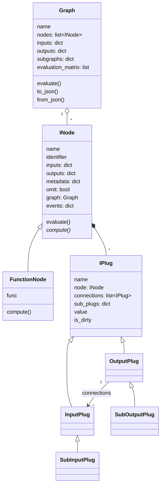

# Flowpipe – Funktionsweise im Detail

Dieses Dokument beschreibt, wie die Python-Bibliothek [Flowpipe](https://github.com/PaulSchweizer/flowpipe) intern funktioniert: Nodes, Plugs (Datentypen), Connections, Graph-Auswertung, Subgraphs und das JSON-Format, das der Web-Editor lädt und speichert.

- **Grundlage:** Flowpipe-Repository, Stand `v1.3.0-9-g9b5a21b` (Commit vom 2026-03-06).
- **Pfadangaben** wie `node.py:199` beziehen sich auf das Package-Verzeichnis `flowpipe/flowpipe/` in diesem Repository.
- Die Beispielausgaben in diesem Dokument und alle Punkte in Abschnitt 9 („Bekannte Fallstricke") wurden mit Python 3.10 gegen diesen Stand ausgeführt und geprüft.

---

## Inhalt

1. [Überblick](#1-überblick)
2. [Architektur auf einen Blick](#2-architektur-auf-einen-blick)
3. [Nodes](#3-nodes)
4. [Plugs und Datentypen](#4-plugs-und-datentypen)
5. [Connections](#5-connections)
6. [Graph und Auswertung](#6-graph-und-auswertung)
7. [Subgraphs](#7-subgraphs)
8. [Serialisierung und JSON-Format](#8-serialisierung-und-json-format)
9. [Bekannte Fallstricke](#9-bekannte-fallstricke)
10. [Konsequenzen für den Web-Editor](#10-konsequenzen-für-den-web-editor)
11. [Dateiübersicht](#11-dateiübersicht)

---

## 1. Überblick

Flowpipe ist ein schlankes Framework für **Flow-Based Programming** in Python (≥ 3.9), ursprünglich für VFX-Pipelines entwickelt. Man baut einen gerichteten, azyklischen Graphen aus Nodes. Jede Node ist eine Rechenfunktion mit benannten Ein- und Ausgängen, den *Plugs*. Flowpipe bestimmt daraus die Ausführungsreihenfolge und führt die Nodes linear, in Threads oder in Prozessen aus.

Eigenschaften, die man kennen sollte:

- **Reine Bibliothek**, keine GUI. Die einzige Laufzeitabhängigkeit ist `ascii-canvas` für die ASCII-Darstellung von Graphen.
- **Dynamisch typisiert**: Plugs haben keinen Datentyp, jeder Python-Wert ist erlaubt.
- **Synchron**: `graph.evaluate()` blockiert, bis alle Nodes fertig sind. Es gibt kein `asyncio`.
- **Kein Undo/Redo**, keine Persistenz außer JSON- und Pickle-Serialisierung.

Öffentliche API (`__init__.py`):

```python
from flowpipe import (
    Graph, INode, Node,                                   # Graph und Nodes
    InputPlug, OutputPlug, SubInputPlug, SubOutputPlug,   # Plugs
    InputPlugGroup,
    Evaluator, LinearEvaluator, ThreadedEvaluator,        # Auswertung
)
```

---

## 2. Architektur auf einen Blick



Die zentrale Designentscheidung: **Es gibt keine Kanten-Objekte.** Eine Verbindung besteht nur darin, dass zwei Plug-Objekte sich gegenseitig in ihrer `connections`-Liste führen. Der Graph ist nur eine Liste von Nodes. Alle Beziehungen (Parents, Children, Subgraphs, Ausführungsreihenfolge) werden bei Bedarf aus diesen Plug-Referenzen berechnet.

---

## 3. Nodes

### 3.1 Aufbau von `INode`

`INode` (`node.py:36`) ist die abstrakte Basisklasse aller Nodes. Der Konstruktor (`node.py:48-97`) legt folgende Attribute an:

| Attribut | Bedeutung |
|---|---|
| `name` | Anzeigename; Standard ist der Klassenname. **Muss innerhalb eines Graphen eindeutig sein** (`Graph.add_node`, `graph.py:163-179`, sonst `ValueError`). |
| `identifier` | Global eindeutige ID, Standard `f"{name}-{uuid4()}"`. Wird in der JSON-Serialisierung zum Verknüpfen der Nodes verwendet. |
| `inputs` / `outputs` | `dict[str, InputPlug]` bzw. `dict[str, OutputPlug]`. Plugs tragen sich beim Erzeugen selbst hier ein. |
| `metadata` | Beliebiges Dict, wird mitserialisiert (z. B. für Positionen im Editor). |
| `omit` | Wenn `True`, wird die Node bei der Auswertung übersprungen. |
| `graph` | Der `Graph`, zu dem die Node gehört. |
| `events` | Vier `Event`-Objekte für den Lebenszyklus (siehe 6.5). |
| `file_location`, `class_name` | Quelldatei und Klassenname, nötig für die Deserialisierung. |
| `stats` | Nach der Auswertung `{"eval_time": …, "start_time": …}`. |
| `upstream_nodes_cache` / `downstream_nodes_cache` | Caches für die transitiven Nachbarn, werden bei jedem `connect`/`disconnect` invalidiert. |

**Welchem Graphen eine Node beitritt**, hängt vom Parameter `graph` ab (`node.py:88-94`):

| `graph=` | Ergebnis |
|---|---|
| `"default"` (Standard bei `INode`) | Globaler Default-Graph (`get_default_graph()`) |
| ein `Graph`-Objekt | dieser Graph |
| `None` | ein **neuer, eigener** `Graph()`. Der Docstring behauptet „not added to any graph", der Code legt aber tatsächlich einen neuen Graphen an. |

### 3.2 Nachbarschaft

| Property | Liefert |
|---|---|
| `parents` / `children` | direkt verbundene Nodes (inkl. Sub-Plug-Verbindungen), `node.py:111-171` |
| `upstream_nodes` / `downstream_nodes` | alle transitiv verbundenen Nodes, gecacht, `node.py:137-197` |
| `is_dirty` | `True`, wenn mindestens ein Input-Plug dirty ist (`node.py:103-109`) |

### 3.3 Ausführung: `evaluate()` und `compute()`

`compute(**inputs)` ist die abstrakte Methode mit der eigentlichen Logik. Sie bekommt die Input-Werte als Keyword-Argumente und gibt ein Dict `{output_name: wert}` zurück.

`evaluate()` (`node.py:199-240`) ist der Rahmen um `compute()`:

```
evaluate()
 ├─ omit == True?  → Event "evaluation-omitted", return {}
 ├─ Event "evaluation-started"
 ├─ inputs = {name: plug.value for name, plug in self.inputs.items()}
 ├─ outputs = self.compute(**inputs) or {}      (Zeit wird gemessen)
 │     └─ Exception → Event "evaluation-exception", erneut werfen
 ├─ self.stats = {"eval_time", "start_time"}
 ├─ für jeden Rückgabe-Key:
 │     "name"        → self.outputs["name"].value = wert
 │     "name.key"    → self.outputs["name"]["key"].value = wert   (Sub-Plug)
 ├─ alle Inputs (inkl. Sub-Plugs) auf is_dirty = False
 └─ Event "evaluation-finished"
```

Zu beachten:

- `evaluate()` **holt keine Daten von Upstream-Nodes**. Es liest nur die aktuellen Werte der eigenen Input-Plugs. Dass diese aktuell sind, stellt der Push-Mechanismus der Connections sicher (siehe 5.3).
- Gibt `compute()` einen Key zurück, den es als Output nicht gibt, fliegt ein `KeyError`.
- Hat ein Input Sub-Plugs, bekommt `compute()` dafür ein Dict `{key: wert}`.

### 3.4 Zwei Arten, Nodes zu definieren

**a) Klassenbasiert:** von `INode` erben, Plugs im Konstruktor anlegen und `compute()` überschreiben.

```python
class Add(INode):
    def __init__(self, a=None, b=1, **kwargs):
        super().__init__(**kwargs)
        InputPlug("a", self, a)
        InputPlug("b", self, b)
        OutputPlug("result", self)

    def compute(self, a, b):
        return {"result": a + b}
```

**b) Funktionsbasiert mit dem `@Node`-Decorator (üblich):**

```python
@Node(outputs=["result"])
def Add(a, b=1):
    return {"result": a + b}

n1 = Add(name="n1", graph=g, a=2)   # erzeugt eine Instanz
```

Was dabei passiert:

1. `Node(...)` (`node.py:764-787`) gibt einen Decorator zurück, der ein **`FunctionNode`-Objekt** erzeugt (`node.py:580`). `Add` ist danach keine Funktion mehr, sondern eine *Vorlagen-Node*. Sie liegt wegen `graph=None` in einem eigenen, anonymen Graphen.
2. `FunctionNode._initialize()` (`node.py:705-754`) liest die Signatur per `inspect.getfullargspec`:
   - Jedes Argument wird ein `InputPlug`, Default-Werte werden Plug-Werte (`b=1` → `inputs["b"].value == 1`).
   - Ein Argument `self` legt keinen Plug an, sondern bewirkt, dass die Node selbst als erstes Argument übergeben wird.
   - Jeder Eintrag in `outputs` wird ein `OutputPlug`, `"name.key"` erzeugt direkt einen Sub-Output.
   - Reservierte Namen sind als Argumente verboten (`ValueError`): `func, name, identifier, inputs, outputs, metadata, omit, graph` (`node.py:584-593`).
3. **Der Aufruf** `Add(name=…, graph=…, **werte)` geht an `FunctionNode.__call__` (`node.py:621-650`). Das erzeugt eine **neue Instanz** mit derselben Funktion und denselben Outputs; Metadata werden tief kopiert und gemerged. Standard ist hier wieder `graph="default"`.
4. `compute()` (`node.py:652-656`) ruft einfach die gespeicherte Funktion auf.

Eine `FunctionNode` lässt sich **nicht pickeln** (`node.py:756-761`), nur als JSON serialisieren.

---

## 4. Plugs und Datentypen

### 4.1 Es gibt keine Datentypen

Flowpipe kennt **keine Plug-Typen** (kein Int-, Float- oder String-Socket). `value` ist `Any`. Beim Verbinden wird nur geprüft, ob die **Richtung** passt (Output → Input). Ob die Daten zusammenpassen, zeigt sich erst zur Laufzeit in `compute()`:

```python
n1.inputs["a"].value = "x"
n1.inputs["b"].value = "y"
g.evaluate()
# n1.result == "xy", danach in n2: TypeError: can only concatenate str (not "int") to str
```

Einschränkungen gibt es nur indirekt:

- **Für JSON-Serialisierung** müssen Werte JSON-serialisierbar sein. `to_json()` liefert ein Dict, `json.dumps` schlägt sonst fehl.
- **Für den Multiprocessing-Evaluator** müssen Werte picklebar sein.

### 4.2 Plug-Klassen

| Klasse | Rolle | Akzeptiert Verbindung von/zu |
|---|---|---|
| `IPlug` (`plug.py:16`) | Basisklasse: `name`, `node`, `connections`, `sub_plugs`, `value`, `is_dirty` | – |
| `OutputPlug` (`plug.py:146`) | Ausgang einer Node | `InputPlug`, `InputPlugGroup` |
| `InputPlug` (`plug.py:244`) | Eingang einer Node, optional mit Startwert | `OutputPlug` |
| `SubOutputPlug` / `SubInputPlug` (`plug.py:339-418`) | Unter-Plug eines Compound-Plugs, Name `"parent.key"` | wie Eltern-Plug |
| `InputPlugGroup` (`plug.py:421`) | Gruppe von InputPlugs auf Graph-Ebene | `OutputPlug` |

Regeln für Namen:

- Plug-Namen dürfen **keinen Punkt** enthalten (`plug.py:30-34`), denn `.` trennt Eltern-Plug und Sub-Plug.
- Sub-Plug-Keys müssen **Strings** sein (`TypeError` sonst), weil JSON nur String-Keys kennt.

### 4.3 `value` und `is_dirty`

**Wert setzen** (`plug.py:77-95`): Der Setter vergleicht einen Hash des alten und des neuen Werts (`utilities.get_hash`, SHA-256 über den Wert oder dessen JSON-Darstellung). Nur wenn sich der Hash ändert oder ein Wert nicht hashbar ist, wird der Plug dirty. Den gleichen Wert erneut zu setzen, macht nichts dirty.

**Wert lesen**: Hat der Plug Sub-Plugs, liefert `value` ein Dict `{key: sub_plug.value}`, sonst den gespeicherten Wert.

Besonderheiten:

- `OutputPlug._update_value` **pusht** den neuen Wert sofort an alle verbundenen Inputs (`plug.py:222-226`).
- `InputPlug._update_value` **ignoriert** direktes Setzen, sobald der Plug Sub-Plugs hat (`plug.py:291-294`).
- `SubOutputPlug._update_value` pusht an die eigenen Verbindungen und aktualisiert zusätzlich den Dict-Wert des Eltern-Plugs (`plug.py:399-406`).

**Dirty-Status** (`plug.py:97-114`): Neue Plugs starten dirty. Wird ein Plug von clean auf dirty gesetzt, ruft er `node.on_input_plug_set_dirty()` auf (`node.py:306-310`). Diese Methode markiert alle an die Outputs der Node angeschlossenen Inputs als dirty. Das löst rekursiv dasselbe in den Nachfolgern aus. Ergebnis: **Eine Änderung macht den gesamten Downstream dirty.** Die Rekursion endet, weil der Setter nichts tut, wenn sich der Status nicht ändert.

```python
g.evaluate()                   # n1 → n2, danach beide clean
n1.inputs["a"].value = 2       # gleicher Wert: n1 clean, n2 clean
n1.inputs["a"].value = 5       # neuer Wert:    n1 dirty, n2 dirty
```

### 4.4 Compound-Plugs (Sub-Plugs)

Sub-Plugs ersetzen Array- oder Dict-Pins. Ein Zugriff per Index erzeugt sie **dynamisch beim ersten Zugriff** (`plug.py:203-220`, `272-289`):

```python
@Node(outputs=["items"])
def Split(value):
    return {"items.0": value, "items.1": value * 2}

sp = Split(name="split", graph=gs, value=3)
c0 = Add(name="c0", graph=gs)
sp.outputs["items"]["0"].connect(c0.inputs["a"])
sp.outputs["items"]["1"].connect(c0.inputs["b"])
gs.evaluate()
# sp.outputs["items"].value == {"0": 3, "1": 6}, c0.result == 9
```

`gs.list_repr()` zeigt die Struktur:

```
gs
 split
  [i] value: 3
  [o] items
   [o] items.0 >> c0.a
   [o] items.1 >> c0.b
 c0
  [i] a << split.items.0
  [i] b << split.items.1
  [o] result: 9
```

Ein Sub-Plug hat den Namen `"items.0"` und den `key` `"0"`. Wird er dirty, wird auch sein Eltern-Plug dirty. Sub-Plugs lassen sich nicht einzeln per `promote_to_graph` freigeben (`TypeError`), nur ihr Eltern-Plug.

### 4.5 `InputPlugGroup`

Eine `InputPlugGroup` (`plug.py:421-473`) registriert sich unter einem Namen in `graph.inputs`. Sie bündelt mehrere InputPlugs, auch aus verschiedenen Nodes. Verbindet man einen Output mit der Gruppe, wird er mit jedem Plug der Gruppe verbunden. `group.value = x` setzt den Wert in allen Plugs. Lesen von `group.value` ist nicht erlaubt (`AttributeError`).

---

## 5. Connections

### 5.1 Darstellung

Eine Connection ist **kein eigenes Objekt**. Sie besteht aus zwei gegenseitigen Referenzen:

```
OutputPlug.connections = [InputPlug, InputPlug, …]   # Fan-out erlaubt
InputPlug.connections  = [OutputPlug]                # höchstens eine Quelle
```

Die Node auf der Gegenseite erreicht man über `plug.node`.

### 5.2 Verbinden

| Aufruf | Wirkung |
|---|---|
| `out.connect(inp)` | Grundform (`plug.py:176-201`) |
| `inp.connect(out)` | leitet an `out.connect(inp)` weiter |
| `out >> inp` | wie `connect` |
| `node_a >> node_b` / `node_a.connect(node_b)` | verbindet alle **namensgleichen** Outputs von `a` mit Inputs von `b` (`node.py:257-304`), bereits existierende Sub-Plugs werden mitverbunden; `ValueError`, wenn kein Name passt |
| `out.connect(group)` | verbindet mit allen Plugs einer `InputPlugGroup` |

Ablauf in `OutputPlug.connect(inp)`:

1. **Richtung prüfen**: sonst `TypeError`.
2. **Graph-Integrität prüfen** über `self.node.graph.accepts_connection(out, inp)` (`graph.py:228-268`). Die Prüfung macht also der Graph der Output-Node.
   - gleiche Node auf beiden Seiten → `CycleError`
   - Output-Node liegt downstream der Input-Node (Zyklus) → `CycleError`
   - Input-Node gehört zu einem Graphen, dessen Name schon für einen *anderen* Subgraphen vergeben ist → `ValueError`
3. **Bestehende Verbindung des Inputs trennen**: Ein Input hat immer höchstens eine Quelle.
4. **Referenzen eintragen**, den aktuellen Output-Wert **sofort in den Input schreiben** (auch wenn er `None` ist) und beide Plugs dirty setzen.
5. **Caches** für upstream/downstream bei beiden Nodes invalidieren.

`disconnect(plug)` (`plug.py:121-135`) entfernt die Referenzen auf beiden Seiten, setzt beide dirty und invalidiert die Caches.

### 5.3 Datenfluss: Push statt Pull

Daten fließen **zum Zeitpunkt des Schreibens**, nicht beim Lesen:

```
n1.evaluate()
  └─ n1.outputs["result"].value = 3
        └─ OutputPlug._update_value
              └─ für jeden verbundenen Input:  n2.inputs["a"].value = 3
n2.evaluate()
  └─ liest n2.inputs["a"].value  (bereits 3)
```

Deshalb ist die **Reihenfolge** der Auswertung entscheidend. Sie ergibt sich aus der topologischen Sortierung (6.2). `evaluate()` selbst fragt Upstream-Nodes nie ab.

---

## 6. Graph und Auswertung

### 6.1 Aufbau von `Graph`

```python
class Graph:
    name: str
    nodes: list[INode]                              # nur die eigenen Nodes
    inputs: dict[str, InputPlug | InputPlugGroup]   # freigegebene Plugs (Subgraph-Schnittstelle)
    outputs: dict[str, OutputPlug]
```

- Es gibt **keine Kantenliste**. Kanten ergeben sich aus den Plugs der Nodes.
- `graph["name"]` sucht eine Node über ihren Namen. `graph["sub.name"]` sucht in einem Subgraphen (`graph.py:50-68`).
- `add_node` erzwingt eindeutige Namen. `delete_node` trennt die Verbindungen und entfernt die Node (siehe Fallstrick 9.3).
- Ein modulweiter **Default-Graph** (`graph.py:516-535`) nimmt alle Nodes ohne expliziten Graphen auf; `reset_default_graph()` leert ihn.

### 6.2 Ausführungsreihenfolge: `evaluation_matrix`

`evaluation_matrix` (`graph.py:102-142`) ist eine an **Kahns Algorithmus** angelehnte topologische Sortierung in Ebenen:

```
Ebene 0: alle Nodes ohne Parents
Ebene k: alle noch nicht einsortierten Children der Ebene k-1,
         deren Parents alle bereits einsortiert sind
```

- Nodes **innerhalb einer Ebene** sind voneinander unabhängig und könnten parallel laufen. Sie werden nach Namen sortiert.
- Ebenen müssen **nacheinander** laufen.
- Grundlage ist `all_nodes`, also die eigenen Nodes plus die Nodes aller Subgraphen (Abschnitt 7).
- `evaluation_sequence` (`graph.py:144-152`) ist die flachgeklopfte Matrix.

Eine Node landet nur dann in der Matrix, wenn alle ihre Parents ebenfalls einsortiert wurden. Hat sie einen Parent außerhalb von `all_nodes`, fällt sie **ohne Fehlermeldung** heraus (siehe 9.3).

### 6.3 `Graph.evaluate()`

```python
graph.evaluate(
    mode="linear",           # "linear" | "threading" | "multiprocessing" | None
    skip_clean=False,        # nur dirty Nodes auswerten
    submission_delay=0.1,    # nur multiprocessing
    max_workers=None,        # nur threading
    data_persistence=True,   # False: Werte verbundener Plugs danach auf None setzen
    evaluator=None,          # eigene Evaluator-Instanz
    on_node_event=None,      # Callback (node, "started"|"finished"|"failed", info)
)
```

`graph.py:270-350` erzeugt aus `mode` den passenden Evaluator und ruft `evaluator.evaluate(graph, skip_clean, on_node_event)` auf.

Wer einen eigenen `evaluator` übergibt, **muss `mode=None` setzen**. Weil `mode` standardmäßig `"linear"` ist, führt `graph.evaluate(evaluator=X)` sonst zu `ValueError: Both 'mode' and 'evaluator' arguments passed.`

### 6.4 Evaluatoren (`evaluator.py`)

Die Basisklasse `Evaluator` (`evaluator.py:27-80`) holt `graph.evaluation_sequence`, filtert bei `skip_clean` auf dirty Nodes und übergibt die Liste an `_evaluate_nodes()`.

| Evaluator | Vorgehen |
|---|---|
| `LinearEvaluator` (`:83-107`) | `for node in nodes: node.evaluate()` im aufrufenden Thread. |
| `ThreadedEvaluator` (`:110-200`) | `ThreadPoolExecutor`. In einer Schleife werden alle Nodes eingereicht, deren `upstream_nodes` alle clean sind, dann wird auf den ersten fertigen Future gewartet. Kann nichts mehr eingereicht werden und läuft nichts, bricht er mit `RuntimeError` („deadlock") ab. |
| `LegacyMultiprocessingEvaluator` (`:203-278`) | Ein OS-Prozess pro Node. Der Zustand jeder Node liegt als `to_json()`-Dict in einem `multiprocessing.Manager().dict()`. Der Kindprozess deserialisiert die Node, holt Upstream-Werte aus diesem Dict, wertet aus und schreibt zurück (`_evaluate_node_in_process`, `:281-323`). Der Hauptprozess überträgt die Ergebnisse danach per `_update_node` auf die Original-Node (`:326-339`). Nodes müssen dafür importierbar und ihre Werte picklebar sein. |

Alle drei **blockieren**, bis alles fertig ist oder ein Fehler auftritt. Eine Exception in einer Node bricht die gesamte Auswertung ab.

Eigene Evaluatoren überschreiben `_evaluate_nodes()`, etwa für eine Render-Farm (`examples/custom_evaluator.py`).

### 6.5 Events und Callbacks

Es gibt zwei unabhängige Beobachtungsmechanismen:

| Mechanismus | Ebene | Ereignisse | Verwendung |
|---|---|---|---|
| `node.events[...]` (`event.py`) | pro Node, beliebig viele Listener | `evaluation-omitted`, `evaluation-started`, `evaluation-finished`, `evaluation-exception` | `node.events["evaluation-finished"].register(fn)`, `fn(node)` |
| `on_node_event` | pro `evaluate()`-Aufruf, ein Callback | `started`, `finished`, `failed` (mit `{"error": exc}`) | wird von allen Evaluatoren aufgerufen |

`on_node_event` eignet sich, um Fortschritt an eine Oberfläche zu melden. Die Node-Events feuern im jeweiligen Thread bzw. Prozess, in dem `node.evaluate()` läuft.

---

## 7. Subgraphs

### 7.1 Konzept

Ein Subgraph ist in Flowpipe **keine Container-Node**, die intern einen Graphen kapselt. Eine solche Klasse gibt es nicht. Ein Subgraph ist einfach **ein anderes `Graph`-Objekt, mit dessen Nodes die eigenen Nodes verbunden sind.**

`Graph.subgraphs` (`graph.py:85-100`) wird bei jedem Zugriff neu berechnet: Für alle eigenen Nodes werden `upstream_nodes` und `downstream_nodes` durchlaufen. Jeder Graph, zu dem eine davon gehört und der nicht `self` ist, zählt als Subgraph. Das Ergebnis hat die Form `{graph.name: graph}`.

Daraus folgt:

- **Die Beziehung ist symmetrisch.** Ist `inner` ein Subgraph von `outer`, ist auch `outer` ein Subgraph von `inner`:
  ```
  outer.subgraphs → ['inner']
  inner.subgraphs → ['outer']
  ```
- Ein Graph ohne Verbindung nach außen hat keine Subgraphs, egal wie viele andere Graphen existieren.
- **Subgraph-Namen müssen eindeutig sein.** Verbindet man sich mit einem anderen Graphen gleichen Namens, meldet `accepts_connection` einen `ValueError`.

### 7.2 Schnittstelle: Plugs freigeben

Damit ein Graph wie ein Baustein wirkt, gibt man innere Plugs unter einem Namen auf Graph-Ebene frei:

```python
inner = Graph(name="inner")
i1 = Add(name="i1", graph=inner)
i1.inputs["a"].promote_to_graph(name="in")        # → inner.inputs["in"]

outer = Graph(name="outer")
o1 = Add(name="o1", graph=outer, a=1)
o1.outputs["result"].connect(inner.inputs["in"])
```

`promote_to_graph` (`plug.py:137-143`) ruft `graph.add_plug()` auf (`graph.py:192-226`). Das legt **dasselbe Plug-Objekt** in `graph.inputs` bzw. `graph.outputs` ab, es gibt keinen Proxy:

```
inner.inputs["in"] is i1.inputs["a"]  → True
```

Die Verbindung im Beispiel ist also eine ganz normale Plug-zu-Plug-Verbindung von `o1` zu `i1`. `graph.inputs` und `graph.outputs` sind nur benannte Abkürzungen auf innere Plugs.

### 7.3 Auswertung über Graphgrenzen

Weil `all_nodes` die Nodes aller Subgraphen einschließt, wertet `outer.evaluate()` auch `inner` aus:

```
outer.evaluation_matrix → [['o1'], ['i1']]
outer.evaluate()        → i1.result == 3
outer["inner.i1"]       → Node i1
```

Konzeptionell gibt es also **einen einzigen zusammenhängenden Abhängigkeitsgraphen**. Die `Graph`-Objekte gruppieren Nodes nur logisch und liefern Namensräume. In der ASCII-Ausgabe (`print(node)`) erscheint der Graph-Name im Rahmen einer Node, sobald ihr Graph Subgraphs hat (`node.py:453-455`).

Beispiel im Repository: `examples/nested_graphs.py`.

---

## 8. Serialisierung und JSON-Format

### 8.1 Überblick

| | JSON | Pickle |
|---|---|---|
| Graph | `graph.to_json()` → `dict`, `Graph.from_json(dict)` | `to_pickle()` / `from_pickle()` |
| Node | `node.to_json()`, `INode.from_json(dict)` | nur klassenbasierte Nodes |

`to_json()` liefert ein **Python-Dict**. Das Schreiben in eine Datei (`json.dump`) übernimmt der Aufrufer.

### 8.2 Schema

```text
Graph
{
  "module":    "flowpipe.graph",   // Modul der Graph-Klasse
  "cls":       "Graph",
  "name":      "<graph-name>",
  "nodes":     [Node, …],          // nur die eigenen Nodes
  "subgraphs": [Graph, …]          // nur auf oberster Ebene; darin kein "subgraphs"-Key
}

Node
{
  "file_location": "<absoluter Pfad der Quelldatei>",
  "module":        "<Modul der Klasse>",   // bei @Node: "flowpipe.node"
  "cls":           "<Klassenname>",        // bei @Node: "FunctionNode"
  "name":          "<name>",
  "identifier":    "<name>-<uuid>",
  "inputs":        { "<plug>": InputPlug, … },
  "outputs":       { "<plug>": OutputPlug, … },
  "metadata":      { … },
  "func":          { "module": "…", "name": "…" }   // nur bei FunctionNode
}

InputPlug
{
  "name":        "<plug>",
  "value":       <JSON-Wert> | null,          // null, wenn der Plug Sub-Plugs hat
  "connections": { "<upstream-identifier>": "<output-plug-name>" },   // 0 oder 1 Eintrag
  "sub_plugs":   { "<key>": SubInputPlug, … }
}

OutputPlug
{
  "name":        "<plug>",
  "value":       <JSON-Wert> | null,
  "connections": { "<downstream-identifier>": ["<input-plug-name>", …] },
  "sub_plugs":   { "<key>": SubOutputPlug, … }
}

SubInputPlug  { "name": "<parent>.<key>", "value": …, "connections": { "<id>": "<output-name>" } }
SubOutputPlug { "name": "<parent>.<key>", "value": …, "connections": { "<id>": ["<input-name>", …] } }
```

Wichtige Details:

- **Connections stehen doppelt drin**: auf der Output-Seite als Liste, auf der Input-Seite als einzelner String. Beim Laden wertet `deserialize_graph` **nur die Input-Seite** aus (`utilities.py:96-108`).
- Ein Plug-Name in `connections` kann ein Sub-Plug-Name wie `"items.0"` sein.
- In `sub_plugs` ist der Dict-Key der kurze Key (`"0"`), das Feld `name` der volle Name (`"items.0"`).
- `value` wird auch bei verbundenen Inputs gespeichert, also der zuletzt gepushte Wert.

### 8.3 Beispiel

Zwei `Add`-Nodes, `s1.result → s2.a`, mit einer Editor-Position in `metadata`. Pfade, UUIDs und der Modulname der Funktion sind vereinfacht, die Struktur ist die echte Ausgabe von `to_json()`:

```json
{
  "module": "flowpipe.graph",
  "cls": "Graph",
  "name": "simple",
  "nodes": [
    {
      "file_location": "<pfad>/nodes.py",
      "module": "flowpipe.node",
      "cls": "FunctionNode",
      "name": "s1",
      "identifier": "s1-<uuid>",
      "inputs": {
        "a": { "name": "a", "value": 1, "connections": {}, "sub_plugs": {} },
        "b": { "name": "b", "value": 1, "connections": {}, "sub_plugs": {} }
      },
      "outputs": {
        "result": {
          "name": "result", "value": null,
          "connections": { "s2-<uuid>": ["a"] },
          "sub_plugs": {}
        }
      },
      "metadata": { "editor": { "position": { "x": 0, "y": 0 } } },
      "func": { "module": "nodes", "name": "Add" }
    },
    {
      "file_location": "<pfad>/nodes.py",
      "module": "flowpipe.node",
      "cls": "FunctionNode",
      "name": "s2",
      "identifier": "s2-<uuid>",
      "inputs": {
        "a": {
          "name": "a", "value": null,
          "connections": { "s1-<uuid>": "result" },
          "sub_plugs": {}
        },
        "b": { "name": "b", "value": 1, "connections": {}, "sub_plugs": {} }
      },
      "outputs": {
        "result": { "name": "result", "value": null, "connections": {}, "sub_plugs": {} }
      },
      "metadata": {},
      "func": { "module": "nodes", "name": "Add" }
    }
  ],
  "subgraphs": []
}
```

### 8.4 Deserialisierung

`Graph.from_json(data)` → `deserialize_graph` (`utilities.py:69-109`):

1. Graph-Klasse über `module` und `cls` importieren und instanziieren.
2. Für jede Node `deserialize_node` aufrufen (`utilities.py:60-66`):
   - `import_class(module, cls, file_location)` (`utilities.py:23-57`) versucht zuerst `importlib.import_module(module)`. Scheitert das oder fehlt die Klasse, wird die Datei unter `file_location` direkt geladen.
   - Die Node wird mit `graph=None` erzeugt, anschließend setzt `post_deserialize(data)` Name, Identifier, Metadata und Plug-Werte.
   - **Bei `FunctionNode`** (`node.py:667-703`) wird zusätzlich die Funktion über `func.module`/`func.name` importiert. Ist das importierte Objekt selbst schon eine `@Node`-Vorlage, wird diese verwendet. Danach werden die Plugs neu aufgebaut und mit Werten befüllt.
3. Die Nodes werden **direkt** in `graph.nodes` eingetragen, ohne `add_node`. Die Namens-Eindeutigkeit wird beim Laden also **nicht** geprüft.
4. Subgraphs werden genauso aufgebaut.
5. Verbindungen werden über die `identifier` aus den `connections` der Input-Plugs mit normalem `connect()` wiederhergestellt.

Beim Laden muss also der Python-Code aller Nodes auf dem ausführenden Rechner importierbar sein, entweder über `module` oder über den absoluten Pfad in `file_location`.

### 8.5 Was nicht serialisiert wird

- `graph.inputs` / `graph.outputs` (freigegebene Plugs) und `InputPlugGroup`s
- `omit`, `stats`, Dirty-Status, registrierte Event-Listener

---

## 9. Bekannte Fallstricke

Alle Punkte wurden gegen den oben genannten Stand ausgeführt und geprüft.

### 9.1 JSON-Laden scheitert bei Verbindungen von Sub-Outputs

Ist ein Input mit einem **Sub-Output** verbunden (z. B. `split.items.0 → c0.a`), steht im JSON `"connections": {"split-…": "items.0"}`. `deserialize_graph` greift darauf mit `upstream.outputs["items.0"]` zu (`utilities.py:101` und `:106`). `outputs` enthält aber nur Eltern-Plugs:

```
Graph.from_json(gs.to_json())  →  KeyError: 'items.0'
```

Im Multiprocessing-Evaluator steht dasselbe Zugriffsmuster (`evaluator.py:302`); dort wurde es nicht separat getestet.

### 9.2 Freigegebene Graph-Plugs gehen beim JSON-Roundtrip verloren

```
simple.inputs  → ['start'],  simple.outputs → ['end']
Graph.from_json(simple.to_json()).inputs / .outputs  →  {} / {}
```

Subgraph-Schnittstellen und `InputPlugGroup`s müssen nach dem Laden neu angelegt werden.

### 9.3 `delete_node` trennt bei Fan-out nicht alle Verbindungen

`delete_node` (`graph.py:181-190`) entfernt Einträge aus `plug.connections`, während es über dieselbe Liste iteriert. Dadurch wird jede zweite Verbindung übersprungen. Test: eine Quelle mit vier Zielen löschen.

```
nodes nach delete_node(src): ['t0', 't1', 't2', 't3']
noch mit src verbunden:      ['t1', 't3']
evaluation_sequence:         ['t0', 't2']      ← t1 und t3 fehlen ohne Fehlermeldung
```

t1 und t3 verweisen weiter auf die gelöschte Node als Parent. Diese liegt nicht mehr in `all_nodes`, deshalb sortiert Kahns Algorithmus t1 und t3 nie ein.

### 9.4 `Event.clear()` entfernt nur jeden zweiten Listener

Gleiche Ursache (`event.py:50-53`): Nach `clear()` mit vier registrierten Listenern sind noch zwei übrig.

### 9.5 Weitere Stolpersteine

- `graph.evaluate(evaluator=…)` ohne `mode=None` → `ValueError` (6.3).
- `graph=None` erzeugt einen neuen Graphen, anders als der Docstring sagt (3.1).
- Keine Typprüfung: Falsche Datentypen fallen erst zur Laufzeit in `compute()` auf (4.1).
- `connect()` ersetzt eine bestehende Verbindung am Input ohne Warnung (5.2).
- `connect()` pusht sofort den aktuellen Output-Wert, auch `None`, und überschreibt damit einen manuell gesetzten Input-Wert.

---

## 10. Konsequenzen für den Web-Editor

Die folgenden Punkte ergeben sich aus dem oben beschriebenen Verhalten und dem JSON-Format.

**Typen und Widgets.** Das JSON enthält keine Plug-Typen. Ein Typ lässt sich nur aus dem gespeicherten `value` ableiten (so macht es derzeit `createInterfaceForPlug` in `src/util/flowpipeBaklavaConverter.ts`) oder zusätzlich in `metadata` hinterlegen. Bei `value: null` gibt es keinen Anhaltspunkt.

**Node-Typ bei `@Node`-Nodes.** Für alle Decorator-Nodes ist `cls == "FunctionNode"` und `module == "flowpipe.node"`. Welche Funktion dahintersteht, steht nur in `func.module` + `func.name`. Der Converter (`src/util/flowpipeBaklavaConverter.ts`) leitet Typ und Titel deshalb aus `func` ab und nur bei klassenbasierten Nodes aus `module` + `cls`. Im Typ `SerializedFlowpipeNode` unterscheiden sich beide Varianten am Feld `func`.

**Verbindungsregeln.**
- Ein Input hat höchstens eine eingehende Verbindung, ein Output beliebig viele.
- Keine Zyklen und keine Verbindungen innerhalb derselben Node. Flowpipe wirft sonst `CycleError`.

**JSON schreiben.**
- `identifier` muss eindeutig sein.
- `name` sollte pro Graph eindeutig sein; beim Laden wird das nicht geprüft, aber `graph["name"]` und `add_node` setzen es voraus.
- Verbindungen müssen **auf der Input-Seite** eingetragen sein, nur die liest der Deserializer. Die Output-Seite sollte aus Konsistenzgründen trotzdem mitgeschrieben werden.
- Plug-Namen dürfen keinen Punkt enthalten.
- `sub_plugs` (an jedem Plug) und `metadata` (an jeder Node) müssen immer vorhanden sein, notfalls leer. Sonst bricht `Graph.from_json` mit `KeyError` ab.

**Metadata.** `metadata` wird unverändert gespeichert und geladen, Flowpipe selbst liest keinen Key daraus. Der Editor legt seine eigenen Daten gebündelt unter `metadata.editor` ab (derzeit die Position), damit sie nicht mit Metadata der Node-Autoren kollidieren. `interpreter` und `batch_size` bleiben auf oberster Ebene, weil die Flowpipe-Beispiele und der Qt-Editor sie dort erwarten. Angaben zu einem Node-*Typ* wie Label oder Kategorie gehören in die Node-Registry, nicht in die Metadata einzelner Nodes.

**Sub-Plugs.** Compound-Plugs stehen in `sub_plugs`. Der Converter berücksichtigt derzeit nur die obersten Plugs. Verbindungen von Sub-Outputs lassen sich wegen 9.1 mit dem unveränderten Flowpipe-Stand nicht per `Graph.from_json` laden.

**Backend.** `file_location` ist ein absoluter Pfad auf dem Rechner, der das JSON erzeugt hat. Das Backend muss die Node-Module über `module` bzw. `func.module` importieren können oder die Datei unter diesem Pfad finden. Für Statusanzeigen während eines Runs eignet sich der `on_node_event`-Callback (6.5).

**Subgraphs.** Da Subgraphs nur verbundene Graphen sind und freigegebene Plugs nicht serialisiert werden (9.2), braucht eine Darstellung als zusammenklappbare Gruppen eigene Informationen, z. B. in `metadata`.

---

## 11. Dateiübersicht

| Datei | Inhalt |
|---|---|
| `flowpipe/__init__.py` | öffentliche API |
| `flowpipe/node.py` | `INode`, `FunctionNode`, `Node`-Decorator, ASCII-Darstellung einer Node |
| `flowpipe/plug.py` | `IPlug`, `InputPlug`, `OutputPlug`, `SubInputPlug`, `SubOutputPlug`, `InputPlugGroup` |
| `flowpipe/graph.py` | `Graph`, `evaluation_matrix`, Subgraphs, (De-)Serialisierung, Default-Graph |
| `flowpipe/evaluator.py` | `Evaluator`, `LinearEvaluator`, `ThreadedEvaluator`, `LegacyMultiprocessingEvaluator` |
| `flowpipe/event.py` | `Event` (Observer) |
| `flowpipe/utilities.py` | `import_class`, `deserialize_node`, `deserialize_graph`, `get_hash`, `NodeEncoder` |
| `flowpipe/errors.py` | `CycleError`, `FlowpipeMultiprocessingError` |
| `examples/` | lauffähige Beispiele, u. a. `nested_graphs.py` (Subgraphs), `graph_plugs.py` (freigegebene Plugs, `InputPlugGroup`), `dynamic_plug_names.py` (Sub-Plugs), `custom_evaluator.py` |
| `tests/` | pytest-Suite; `test_subgraphs.py`, `test_graph.py`, `test_plugs.py` zeigen das erwartete Verhalten |
