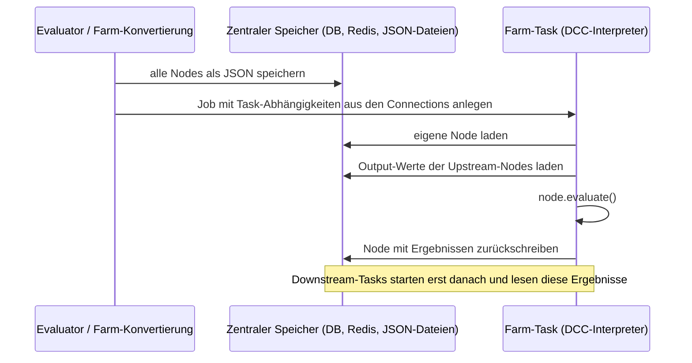

# Flowpipe in der VFX-Produktion – Erkenntnisse aus dem Vortrag von RISE FX

Zusammenfassung des Lightning Talks **„Flowpipe – VFX Production Proven Flow-based Programming"** von Jonas Sorgenfrei (Pipeline Developer, RISE FX Berlin), abgeglichen mit dem Quellcode von Flowpipe und dem Qt-basierten `flowpipe-editor`.

- **Quelle:** automatisch erzeugtes YouTube-Transkript. Namen und Fachbegriffe sind darin teils falsch erkannt, siehe [Abschnitt 2](#2-korrekturen-am-transkript).
- **Abgleich:** Aussagen über Flowpipe selbst wurden gegen den Code geprüft (Stand `v1.3.0-9-g9b5a21b`). Aussagen über die interne RISE-Pipeline lassen sich nicht prüfen und sind als Aussagen des Vortrags wiedergegeben.
- **Ergänzt:** [flowpipe-funktionsweise.md](flowpipe-funktionsweise.md), die technische Beschreibung von Flowpipe. Verweise wie „FW 7" zeigen auf die Abschnitte dort.

---

## Inhalt

1. [Kernaussagen](#1-kernaussagen)
2. [Korrekturen am Transkript](#2-korrekturen-am-transkript)
3. [Warum Flowpipe](#3-warum-flowpipe)
4. [Architektur laut Vortrag – Abgleich mit dem Code](#4-architektur-laut-vortrag--abgleich-mit-dem-code)
5. [Konventionen aus der Produktion](#5-konventionen-aus-der-produktion)
6. [Verteilte Ausführung und Render-Farm](#6-verteilte-ausführung-und-render-farm)
7. [Einsatz bei RISE FX](#7-einsatz-bei-rise-fx)
8. [Der Qt-basierte flowpipe-editor](#8-der-qt-basierte-flowpipe-editor)
9. [Geplante Weiterentwicklung](#9-geplante-weiterentwicklung)
10. [Bedeutung für den Web-Editor](#10-bedeutung-für-den-web-editor)

---

## 1. Kernaussagen

- Flowpipe ist bei RISE FX **das zentrale Framework der Pipeline**. Farm-Anbindung, Publishing, Ingest und Artist-Workflows laufen darüber.
- Der Nutzen liegt vor allem darin, dass Abläufe **als Graph sichtbar** werden, Nodes **wiederverwendbar** sind und Ausführung **parallel** möglich ist, ohne proprietäre Abhängigkeiten.
- Über den Metadata-Key **`interpreter`** wird festgelegt, in welcher Anwendung (Houdini, Maya, Nuke …) eine Node läuft. Das hat sich laut Vortrag in Umgebungen mit mehreren DCCs bewährt.
- Die Ausführung auf der Render-Farm folgt einem festen Muster: **Graph → Farm-Job**, Nodes als JSON in einem **zentralen Speicher**, jede Node holt ihre Eingangsdaten von dort und legt ihre Ergebnisse dort ab.
- Flowpipe liefert die **Mechanik**, aber nicht die Ausführung in verschiedenen Interpretern. Dafür gibt es nur Beispiele.
- Der bestehende **Qt-Editor ist nur ein Visualizer**. Graphen im Editor **bearbeiten und ausführen** sowie **typisierte Plugs** werden ausdrücklich als Ziele für die Zukunft genannt.

---

## 2. Korrekturen am Transkript

| Im Transkript | Gemeint |
|---|---|
| Yuna Songfi | Jonas Sorgenfrei (laut Videotitel; auch Autor von `jonassorgenfrei/flowpipe-editor`) |
| Rice Fix / rise | RISE FX (VFX-Studio in Berlin) |
| Paul Schwitzer | Paul Schweizer, Autor von Flowpipe, Head of Pipeline bei RISE |
| iode class | `INode` |
| node graph QT … Johnny Chan | NodeGraphQt von jchanvfx (Johnny Chan) |
| FF FFMP | ffmpeg |
| mara | Maya |
| reddis | Redis |
| flower | Flower (Monitoring-Oberfläche für Celery) |
| pipel / pipelish | vermutlich Pyblish (Publish-Framework mit den Schritten Collect, Validate, Extract, Integrate) |
| slapcom / slapstick | Slapcomp; „Slapstick" ist der Name des internen Nuke-Frameworks |
| rice flow | RISE Flow (internes System der 3D-Abteilung) |
| myi and piling | vermutlich mypy und Pylance bzw. Pylint (nicht eindeutig) |
| fessy farm | **unklar**, der Name der Farm-Software ist nicht sicher erkennbar |
| sudin based execution action | **unklar**, dem Kontext nach eine Houdini-basierte Ausführungs-Aktion |

---

## 3. Warum Flowpipe

Der Vortrag nennt drei Hauptvorteile:

1. **Visualisierung**: Code, Module, ihre Abhängigkeiten und die Ausführung werden als Graph darstellbar. Auch komplexe Workflows bleiben dadurch nachvollziehbar.
2. **Wiederverwendbarkeit**: Funktionen und Module werden als verallgemeinerte Bausteine (Nodes) geschrieben.
3. **Eingebaute Nebenläufigkeit**: Die Nodes lassen sich über Threads oder Prozesse parallel ausführen.

Architekturziel ist ein **einheitliches, leicht erweiterbares Code-Design ohne proprietäre Abhängigkeiten**. Flowpipe lässt sich per `pip` installieren. Code, Beispiele und Dokumentation liegen auf GitHub, und das gesamte RISE-Pipeline-Team hat dazu beigetragen.

Die Datei `flowpipe-for-vfx-pipelines.md` im Flowpipe-Repository vertieft die Motivation:

- In Pipelines ohne gemeinsames Framework löst jeder Entwickler Probleme anders. Flowpipe gibt eine einheitliche Struktur vor.
- Eine Planung in Graphform lässt sich oft direkt in einen Flowpipe-Graphen übertragen. Das hilft auch in Gesprächen mit nicht-technischen Beteiligten.
- Ohne eine solche Abstraktion hinterlässt die Farm-API ihre Spuren überall im Code. Flowpipe kapselt die Farm-Anbindung an einer Stelle.

---

## 4. Architektur laut Vortrag – Abgleich mit dem Code

| Aussage im Vortrag | Befund im Code |
|---|---|
| Kern sind **Node** und **Graph**, die sich gegenseitig referenzieren. | Stimmt: `node.graph` und `graph.nodes` (FW 3.1, 6.1). |
| Nodes und Graphen haben `inputs` als Dict von `InputPlug` und `outputs` mit `OutputPlug`. | Stimmt. Bei Graphen sind das die per `promote_to_graph` freigegebenen Plugs (FW 7.2). |
| `InputPlug` und `OutputPlug` sind Unterklassen eines Plugs, der Werte und Verbindungen hält. | Stimmt: `IPlug` mit `value` und `connections` (FW 4.2). |
| Nodes entstehen per Unterklasse von `INode` (Plugs und Metadata im Konstruktor, Logik in `compute`) oder per `@Node`-Decorator. | Stimmt (FW 3.4). |
| `compute` gibt ein Dict mit den Output-Werten zurück. | Stimmt (FW 3.3). |
| Nodes werden über den Parameter `graph` einem Graphen zugeordnet. | Stimmt. Ohne Angabe landen sie im Default-Graphen (FW 3.1). |
| Verbunden wird über `connect` von Output- zu Input-Plugs. | Stimmt (FW 5.2). |
| Über `add_plug` freigegebene Plugs machen Graphen als verschachtelte Subgraphs nutzbar. | Stimmt, mit einer Einschränkung: Subgraphs sind verbundene, gleichberechtigte Graphen, keine Container (FW 7.1). |
| `InputPlugGroup` bündelt mehrere Input-Plugs. | Stimmt (FW 4.5). |
| Nodes werden in Abhängigkeitsreihenfolge ausgewertet. | Stimmt: topologische Sortierung in `evaluation_matrix` (FW 6.2). |
| Drei Evaluatoren (sequenziell, Threads, Prozesse), eigene Evaluatoren über `_evaluate_nodes`. | Stimmt (FW 6.4). Beispiel: `examples/custom_evaluator.py` gibt Name und Metadata jeder Node aus und ruft dann `node.evaluate()` auf. |

Der Vortrag bestätigt damit die Beschreibung in `flowpipe-funktionsweise.md`. Neu sind vor allem die **Konventionen** und **Einsatzmuster** in den folgenden Abschnitten.

---

## 5. Konventionen aus der Produktion

### 5.1 `metadata["interpreter"]` bestimmt die Ausführungsumgebung

Jede Node trägt in ihrer Metadata, in welchem Interpreter sie laufen muss, zum Beispiel:

```python
@Node(outputs=["renderings"], metadata={"interpreter": "houdini"})
def HoudiniRender(frames, scene_file):
    ...
```

Der Wert wird an drei Stellen genutzt:

| Wo | Wofür |
|---|---|
| eigener Evaluator bzw. Farm-Konvertierung | Wahl des Interpreters bzw. Kommandos (`mayapy`, `hython`, …) |
| `examples/vfx_render_farm_conversion.py` | `COMMANDS[node.metadata.get("interpreter", "python")]` |
| `flowpipe-editor` | Icon der Node (`icons/<interpreter>.png`), sonst `python.png` |

Verwendete Werte in Beispielen und Editor-Icons: `python`, `maya`, `houdini`, `nuke`, `mari`, `3dequalizer`.

### 5.2 DCC-Module innerhalb der Node importieren

Die Module der DCC-Anwendung (z. B. `hou` für Houdini) werden **innerhalb** von `compute` bzw. der Funktion importiert, nicht am Dateianfang. So lässt sich die Node auch in reinem Python laden: um den Graphen zu bauen, zu visualisieren, zu serialisieren oder in einen Farm-Job umzuwandeln. Erst bei der Ausführung im richtigen Interpreter wird das DCC-Modul gebraucht.

### 5.3 Farm-Einstellungen gehören in die Metadata

Alle farmspezifischen Einstellungen werden in der Node-Metadata abgelegt und bei der Umwandlung in einen Farm-Job ausgewertet. Im Beispiel steuert `metadata["batch_size"]` das *implizite Batching*: Eine Node wird auf der Farm in mehrere Tasks über Frame-Bereiche aufgeteilt.

### 5.4 Beispiele für Nodes aus dem Vortrag

- **Houdini-Workfile aus Template**: erzeugt für ein Projekt und einen Shot eine neue Arbeitsdatei aus einer Vorlage, mit `interpreter: houdini`.
- **EXR-Sequenz → QuickTime**: ruft `ffmpeg` in einem Python-`subprocess` auf und läuft daher in reinem Python.

Das Muster dahinter: **Eine Node macht genau eine Sache**, egal ob sie Python-Code, eine DCC-API oder ein Kommandozeilen-Tool verwendet.

---

## 6. Verteilte Ausführung und Render-Farm

### 6.1 Das Muster



Laut Vortrag und `flowpipe-for-vfx-pipelines.md` besteht die Farm-Abstraktion aus **drei Bausteinen**:

1. **Graph → Job**: Jede Node wird ein Farm-Task. Die Connections bestimmen die Abhängigkeiten zwischen den Tasks.
2. **Node auf der Farm auswerten**: deserialisieren, Eingänge befüllen, `evaluate()`, zurückschreiben.
3. **Datentransfer zwischen Nodes** über den zentralen Speicher.

Der zentrale Speicher ist entscheidend: Jede Node wird **isoliert** in einem eigenen Prozess ausgewertet und kennt ihre Upstream-Nodes nur über deren gespeicherte Daten.

Ausführungsorte laut Vortrag: in der laufenden Session, in Subprozessen der jeweiligen DCC-Interpreter oder verteilt auf der Render-Farm mit Job-Abhängigkeiten.

### 6.2 Umsetzung im Flowpipe-Repository

`examples/vfx_render_farm_conversion.py` zeigt alle drei Bausteine:

- `JsonDatabase` speichert jede Node als JSON-Datei unter ihrem `identifier`. Laut Kommentar erleichtert dateibasierter Speicher das Debuggen, weil man die Dateien direkt bearbeiten kann.
- `convert_graph_to_job` baut Tasks mit Kommandos je Interpreter und übernimmt die Abhängigkeiten aus `upstream_nodes`.
- `evaluate_on_farm` lädt die Node, befüllt ihre Inputs aus den Upstream-Dateien, wertet aus und speichert zurück.
- Es gibt zwei Arten des Batchings. **Implizit**: `batch_size` in der Metadata, die Aufteilung passiert bei der Konvertierung. **Explizit**: Pro Batch gibt es eine eigene Node im Graphen, die über Sub-Plugs (`images["0"]`, `images["10"]`, …) zusammengeführt werden.

Das Repository selbst nennt die Datei eine **Pseudo-Implementierung**. Beim Lesen fällt auf, dass sie nicht direkt lauffähig ist:

- Sie verwendet die veralteten `node.serialize()` und `INode.deserialize()`.
- `logging.baseConfig` existiert nicht, gemeint ist `logging.basicConfig`.
- `node.inputs["frames"] = frames` ersetzt den Plug durch eine Liste, statt `.value` zu setzen.
- `evaluate_on_farm` liest nur die obersten `connections` der Inputs und keine `sub_plugs`. Beim expliziten Batching kämen die Daten also nicht an.

Diese Punkte sind durch Lesen des Codes festgestellt, nicht durch Ausführen.

Dasselbe Muster steckt auch im eingebauten `LegacyMultiprocessingEvaluator`. Dort ist ein `multiprocessing.Manager().dict()` der zentrale Speicher (FW 6.4).

### 6.3 Celery-Adapter

Als weitergehendes Beispiel nennt der Vortrag ein eigenes Repository (`flowpipe-celery-adapter`, im Flowpipe-README verlinkt, lokal nicht vorhanden):

- Die Nodes eines Graphen werden in **Celery-Tasks** umgewandelt und über Celery verteilt und geplant.
- Mit **Flower** lassen sich Status und Tasks im Browser beobachten, einschließlich der serialisierten Node-Daten und Werte.

---

## 7. Einsatz bei RISE FX

Diese Angaben stammen aus dem Vortrag und lassen sich nicht anhand von Code prüfen.

### 7.1 Infrastruktur

- **Farm-Anbindung**: ein Modul, das Flowpipe-Graphen in Jobs für die Render-Farm umwandelt, mit **Redis** als Key-Value-Speicher dazwischen. Der Name der Farm-Software ist im Transkript nicht sicher erkennbar.
- **DCCs**: Houdini, Maya, Nuke, Mari und weitere Python-Anwendungen werten Flowpipe-Nodes aus.
- **Datenaustausch** über eine USD-basierte Layer-Pipeline und die interne Datenbank.
- Der **flowpipe-editor** dient zur Visualisierung von Graphen vor und nach der Farm-Submission.
- Ergebnis laut Vortrag: Viel Farm- und Workflow-Code konnte aufgeräumt und vereinheitlicht werden.

### 7.2 Darauf aufgebaute Systeme

| System | Zweck |
|---|---|
| Validate/Extract/Integrate-Graph (vermutlich Pyblish) | testgetriebenes Export- und Publish-Framework |
| Web-Service-Anbindung | Python-Aktionen für Datenbank und Projektmanagement-Tools |
| Ingest/Delivery/Transfer | einheitlicher Workflow für Assets |
| Slapstick | halbautomatische Slapcomps auf Basis von Nuke-Templates |
| RISE Flow | Automatisierung für die 3D-Abteilung, über mehrere Shots und Assets hinweg |

### 7.3 RISE Flow im Detail

Artists wählen in einer Oberfläche Einstellungen. Ein **Action-Modul** baut daraus Flowpipe-Graphen und kann mehrere Aktionen zu einem größeren Graphen verketten. Eine Houdini-basierte Aktion besteht aus diesen Nodes:

1. Neuestes **Template** aus der Datenbank abfragen.
2. Daraus eine **neue Workfile-Version** im Shot- oder Asset-Kontext anlegen.
3. **Parameter-Overrides** aus der Oberfläche auf eine Control-Node in der neuen Datei übertragen.
4. Das **Houdini-Abhängigkeitsnetz** an einer bestimmten Node auf die Farm schicken (Simulationen, Caches, Renderings, USD-Layer-Exporte, Publishes).
5. **Warten**, bis das Netz auf der Farm erfolgreich durchgelaufen ist.
6. Bei USD-Layer-Exporten das zugehörige **Datenbank-Asset abfragen** und mit den eingehenden Layer-Assets zusammenführen.

Bei verketteten Aktionen werden die Layer-Informationen genutzt, um die Layer-Versionen über den **USD Asset Resolver** festzuschreiben. Folgende Aktionen laden damit genau die gerade erzeugten Versionen.

RISE Flow ist außerdem als **Post-Publish-Aktion** eingebunden. Artists können Aktionen konfigurieren, oder sie werden automatisch nach einem erfolgreichen Publish ausgeführt. Beispiel: Ein einheitliches QC-Template läuft bei jedem Layer-Publish eines Shots oder Assets automatisch, unabhängig vom DCC.

Das entspricht dem **Workflow Design Pattern** aus `flowpipe-for-vfx-pipelines.md` und `examples/workflow_design_pattern.py`. Ein Workflow baut einen Graphen aus Nutzereinstellungen und Daten aus Datenbank oder Dateisystem. Er kann lokal oder auf der Farm ausgeführt werden.

---

## 8. Der Qt-basierte flowpipe-editor

Laut Vortrag ist der `flowpipe-editor` ein Qt-Widget auf Basis von NodeGraphQt. Ziel ist ein echter Editor zum Erstellen und Ändern von Graphen, derzeit ist er **nur ein Visualizer**. Der Code (`flowpipe-editor/flowpipe_editor/`) bestätigt das:

- `load_graph(graph)` bekommt einen **fertigen Python-Graphen** und baut daraus die Qt-Nodes. Die Spalten entsprechen den Ebenen der `evaluation_matrix`, danach wird automatisch angeordnet.
- Die Ports werden aus `all_inputs()` / `all_outputs()` erzeugt, **Sub-Plugs erscheinen also als eigene Ports**.
- Das Icon kommt aus `metadata["interpreter"]`.
- Das Eigenschaften-Panel zeigt Beschreibung (Docstring, Link zur Quelldatei), Input- und Output-Werte sowie Metadata an. Die Wertfelder sind schreibgeschützt (`setReadOnly(True)`).
- Es gibt **keinen Rückweg**: Änderungen im Qt-Graphen werden nicht auf den Flowpipe-Graphen übertragen. Laden oder Speichern von JSON und Ausführen sind nicht vorgesehen.

---

## 9. Geplante Weiterentwicklung

Am Ende des Vortrags werden zwei Vorhaben genannt:

1. **Statische Typisierung und typisierte Plugs** im Framework. Nutzen: bessere Darstellung und Bearbeitung von Node-Parametern im Editor sowie bessere Unterstützung durch Typprüfer (im Transkript „myi and piling", vermutlich mypy und Pylance/Pylint).
2. **Editor-Funktionen ausbauen**: Graphen direkt im visuellen Editor erzeugen und ausführen.

Beitragende sind ausdrücklich willkommen.

---

## 10. Bedeutung für den Web-Editor

**Der Web-Editor setzt genau die angekündigte Roadmap um.** Punkt 2 aus Abschnitt 9, Graphen im Editor erstellen und ausführen, ist das, was der Qt-Editor noch nicht kann und der Web-Editor leistet: Laden und Speichern als JSON, Nodes anlegen und verbinden, Ausführung über ein Backend.

**Fehlende Plug-Typen bleiben die Hauptlücke.** Solange Flowpipe keine typisierten Plugs hat, muss der Editor Typen selbst ableiten (aus dem Wert, FW 10) oder über eine eigene Quelle beschreiben, etwa die im README vorgesehene, aber noch nicht vorhandene `node-registry.json`. Wenn Flowpipe später typisierte Plugs bekommt, sollte das Registry-Format sich leicht daran anpassen lassen.

**`interpreter` ist eine etablierte Konvention.** `src/types/flowpipe.ts` bildet das Feld als `FlowpipeInterpreter` ab, mit denselben Werten, für die der Qt-Editor Icons hat (`python`, `maya`, `houdini`, `nuke`, `mari`, `3dequalizer`), und offen für weitere. Icons oder Farben nach Interpreter würden zum Qt-Editor passen.

**Farm-Einstellungen gehören in die Metadata.** `batch_size` ist ebenfalls schon in `flowpipe.ts` vorgesehen. Das Eigenschaften-Panel sollte Metadata daher bearbeitbar machen, denn dort landen Farm- und Ausführungsparameter.

**Das Backend kann dem Farm-Muster folgen.** Speicher pro Node über ihren `identifier`, Abhängigkeiten aus den Connections, Status pro Node. Für Statusanzeigen im Editor bietet sich der `on_node_event`-Callback an (FW 6.5). Für längere, verteilte Läufe zeigt der Celery-Adapter mit Flower, wie eine Oberfläche Task-Status und Node-Daten darstellen kann.

**Workflow-Graphen werden in der Praxis generiert.** Bei RISE entstehen Graphen meist programmatisch aus Nutzereinstellungen (Workflow Design Pattern) statt von Hand. Ein Editor, der solche Graphen **laden und nachvollziehbar darstellen** kann, ist deshalb mindestens so wichtig wie das freie Zeichnen. Das gilt auch für große Graphen mit expliziten Batches und für verkettete Aktionen über mehrere Subgraphs.

**Sub-Plugs werden in der Praxis genutzt.** Explizites Batching führt Ergebnisse über Sub-Plugs zusammen. Der Qt-Editor zeigt sie als eigene Ports an. Für den Web-Editor bedeutet das: `sub_plugs` im JSON berücksichtigen. Beim Laden in Flowpipe ist der Fehler aus FW 9.1 zu beachten.
